[](https://classroom.github.com/a/YFgwt0yY)
# MiniTorch Module 2


* Docs: https://minitorch.github.io/

* Overview: https://minitorch.github.io/module2/module2/

This assignment requires the following files from the previous assignments. You can get these by running

```bash
python sync_previous_module.py previous-module-dir current-module-dir
```

The files that will be synced are:

        minitorch/operators.py minitorch/module.py minitorch/autodiff.py minitorch/scalar.py minitorch/scalar_functions.py minitorch/module.py project/run_manual.py project/run_scalar.py project/datasets.py

# Task 2.5 Results

## Simple Data Set

### Parameters
- 50 points
- 2 hidden layers
- 0.1 Learning Rate
- 1000 epochs

### Initial Setting

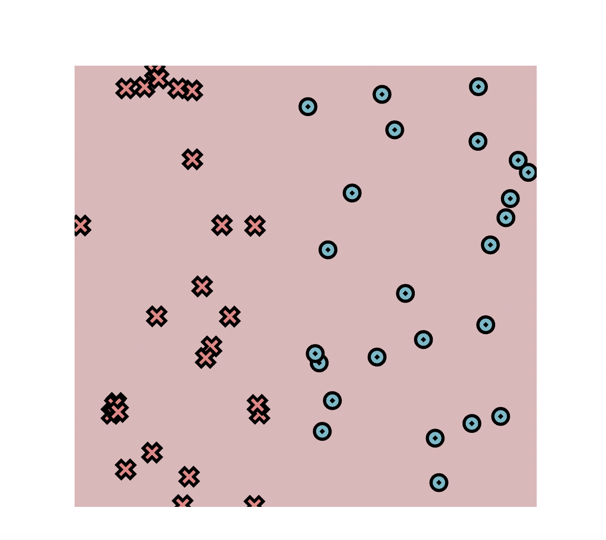

### Trained Results

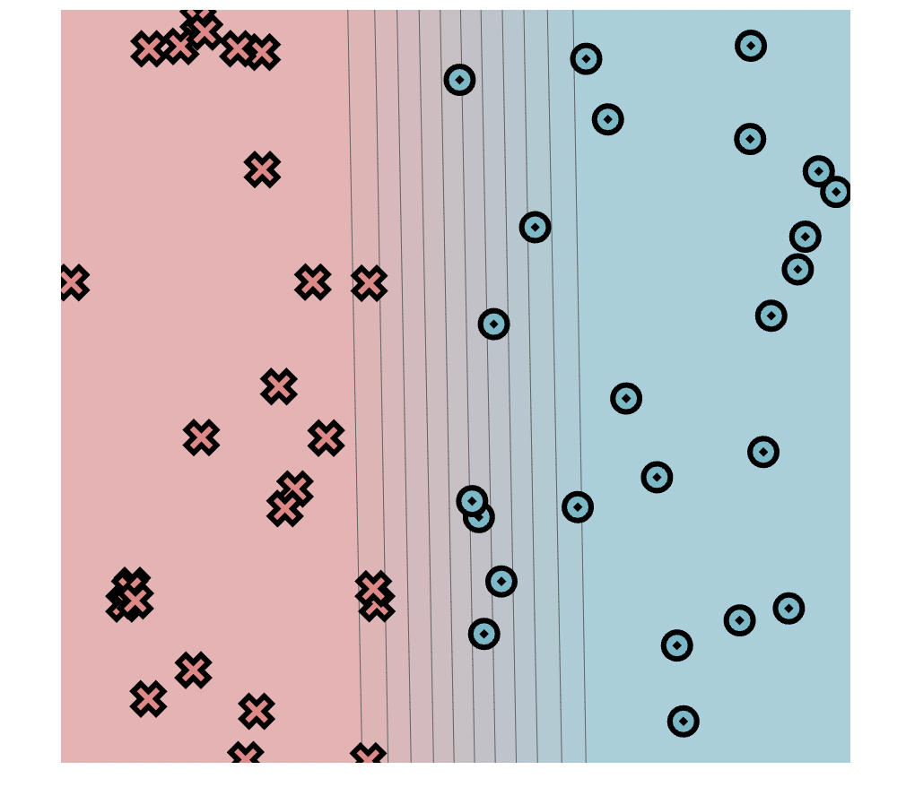

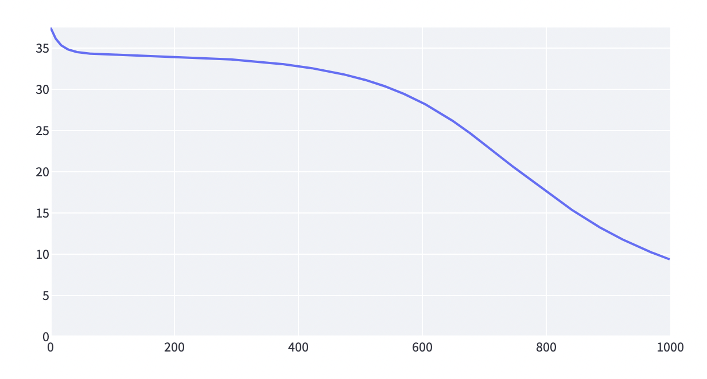


### Logs

```
Epoch: 10/1000, loss: 36.08883357160892, correct: 26
Epoch: 20/1000, loss: 35.23507040275149, correct: 26
Epoch: 30/1000, loss: 34.81482890727404, correct: 26
Epoch: 40/1000, loss: 34.573858583525315, correct: 26
Epoch: 50/1000, loss: 34.434436681325145, correct: 26
Epoch: 60/1000, loss: 34.35129888588819, correct: 26
Epoch: 70/1000, loss: 34.298813100164516, correct: 26
Epoch: 80/1000, loss: 34.2628441071759, correct: 26
Epoch: 90/1000, loss: 34.23519152958362, correct: 26
Epoch: 100/1000, loss: 34.21166403343843, correct: 26
Epoch: 110/1000, loss: 34.190336533950955, correct: 26
Epoch: 120/1000, loss: 34.16964781894762, correct: 26
Epoch: 130/1000, loss: 34.148794686384726, correct: 26
Epoch: 140/1000, loss: 34.1273984219812, correct: 26
Epoch: 150/1000, loss: 34.105162733977934, correct: 26
Epoch: 160/1000, loss: 34.0818662830296, correct: 26
Epoch: 170/1000, loss: 34.0573743327649, correct: 26
Epoch: 180/1000, loss: 34.03154553419217, correct: 26
Epoch: 190/1000, loss: 34.00433088193091, correct: 26
Epoch: 200/1000, loss: 33.975566546147434, correct: 26
Epoch: 210/1000, loss: 33.945154887384085, correct: 26
Epoch: 220/1000, loss: 33.912915576896914, correct: 26
Epoch: 230/1000, loss: 33.87882784010574, correct: 26
Epoch: 240/1000, loss: 33.842645498657426, correct: 26
Epoch: 250/1000, loss: 33.80427224841549, correct: 26
Epoch: 260/1000, loss: 33.76349987825598, correct: 26
Epoch: 270/1000, loss: 33.72020156345839, correct: 26
Epoch: 280/1000, loss: 33.6741810791906, correct: 26
Epoch: 290/1000, loss: 33.625201942596696, correct: 26
Epoch: 300/1000, loss: 33.57306968747329, correct: 26
Epoch: 310/1000, loss: 33.51753147856104, correct: 26
Epoch: 320/1000, loss: 33.45831581660316, correct: 26
Epoch: 330/1000, loss: 33.39513783942978, correct: 26
Epoch: 340/1000, loss: 33.32766957332252, correct: 26
Epoch: 350/1000, loss: 33.25555333835448, correct: 27
Epoch: 360/1000, loss: 33.17839808587355, correct: 31
Epoch: 370/1000, loss: 33.095775708407245, correct: 31
Epoch: 380/1000, loss: 33.00727515302363, correct: 34
Epoch: 390/1000, loss: 32.91264054375584, correct: 34
Epoch: 400/1000, loss: 32.811218900391125, correct: 36
Epoch: 410/1000, loss: 32.70246110156298, correct: 36
Epoch: 420/1000, loss: 32.585882080661854, correct: 36
Epoch: 430/1000, loss: 32.460777493207914, correct: 37
Epoch: 440/1000, loss: 32.3265222165813, correct: 38
Epoch: 450/1000, loss: 32.18386372202374, correct: 38
Epoch: 460/1000, loss: 32.033335455870244, correct: 39
Epoch: 470/1000, loss: 31.8737919726184, correct: 39
Epoch: 480/1000, loss: 31.70156786359677, correct: 39
Epoch: 490/1000, loss: 31.516956890515722, correct: 39
Epoch: 500/1000, loss: 31.319315780853263, correct: 40
Epoch: 510/1000, loss: 31.108026798395503, correct: 40
Epoch: 520/1000, loss: 30.880238346184846, correct: 40
Epoch: 530/1000, loss: 30.63736033825248, correct: 40
Epoch: 540/1000, loss: 30.37678631420686, correct: 40
Epoch: 550/1000, loss: 30.097304068659906, correct: 41
Epoch: 560/1000, loss: 29.80038073392042, correct: 41
Epoch: 570/1000, loss: 29.48237299086018, correct: 42
Epoch: 580/1000, loss: 29.143182940640106, correct: 42
Epoch: 590/1000, loss: 28.783109372854195, correct: 43
Epoch: 600/1000, loss: 28.402614279897627, correct: 43
Epoch: 610/1000, loss: 28.00011955058376, correct: 43
Epoch: 620/1000, loss: 27.575350399299282, correct: 43
Epoch: 630/1000, loss: 27.126921067300596, correct: 43
Epoch: 640/1000, loss: 26.656380606013485, correct: 43
Epoch: 650/1000, loss: 26.16219980747625, correct: 43
Epoch: 660/1000, loss: 25.644866656544114, correct: 43
Epoch: 670/1000, loss: 25.11181721101126, correct: 43
Epoch: 680/1000, loss: 24.562814708708558, correct: 44
Epoch: 690/1000, loss: 24.001732594768534, correct: 44
Epoch: 700/1000, loss: 23.424575916256867, correct: 44
Epoch: 710/1000, loss: 22.843138972205683, correct: 44
Epoch: 720/1000, loss: 22.246239537471887, correct: 44
Epoch: 730/1000, loss: 21.643235042287557, correct: 44
Epoch: 740/1000, loss: 21.03926089042005, correct: 45
Epoch: 750/1000, loss: 20.442138159247435, correct: 44
Epoch: 760/1000, loss: 19.853584379485763, correct: 45
Epoch: 770/1000, loss: 19.27617103812969, correct: 45
Epoch: 780/1000, loss: 18.706421078997753, correct: 45
Epoch: 790/1000, loss: 18.150227196344144, correct: 45
Epoch: 800/1000, loss: 17.598462071088942, correct: 46
Epoch: 810/1000, loss: 17.056257901850728, correct: 47
Epoch: 820/1000, loss: 16.52194754360948, correct: 47
Epoch: 830/1000, loss: 15.998867863717845, correct: 48
Epoch: 840/1000, loss: 15.487759648671108, correct: 49
Epoch: 850/1000, loss: 14.98853750702091, correct: 49
Epoch: 860/1000, loss: 14.502031513870598, correct: 49
Epoch: 870/1000, loss: 14.026988582983927, correct: 49
Epoch: 880/1000, loss: 13.57253920935301, correct: 49
Epoch: 890/1000, loss: 13.138282324561, correct: 49
Epoch: 900/1000, loss: 12.720721972899888, correct: 49
Epoch: 910/1000, loss: 12.323502492783502, correct: 50
Epoch: 920/1000, loss: 11.94080405554002, correct: 50
Epoch: 930/1000, loss: 11.571738745435386, correct: 50
Epoch: 940/1000, loss: 11.214530652125353, correct: 50
Epoch: 950/1000, loss: 10.871772336794372, correct: 50
Epoch: 960/1000, loss: 10.544601257913943, correct: 50
Epoch: 970/1000, loss: 10.234632708654154, correct: 50
Epoch: 980/1000, loss: 9.935599332012897, correct: 50
Epoch: 990/1000, loss: 9.64916451404238, correct: 50
Epoch: 1000/1000, loss: 9.373797046255262, correct: 50
```

## Diag Data Set

### Parameters
- 50 points
- 2 hidden layers
- 0.5 Learning Rate
- 2000 epochs

### Initial Setting

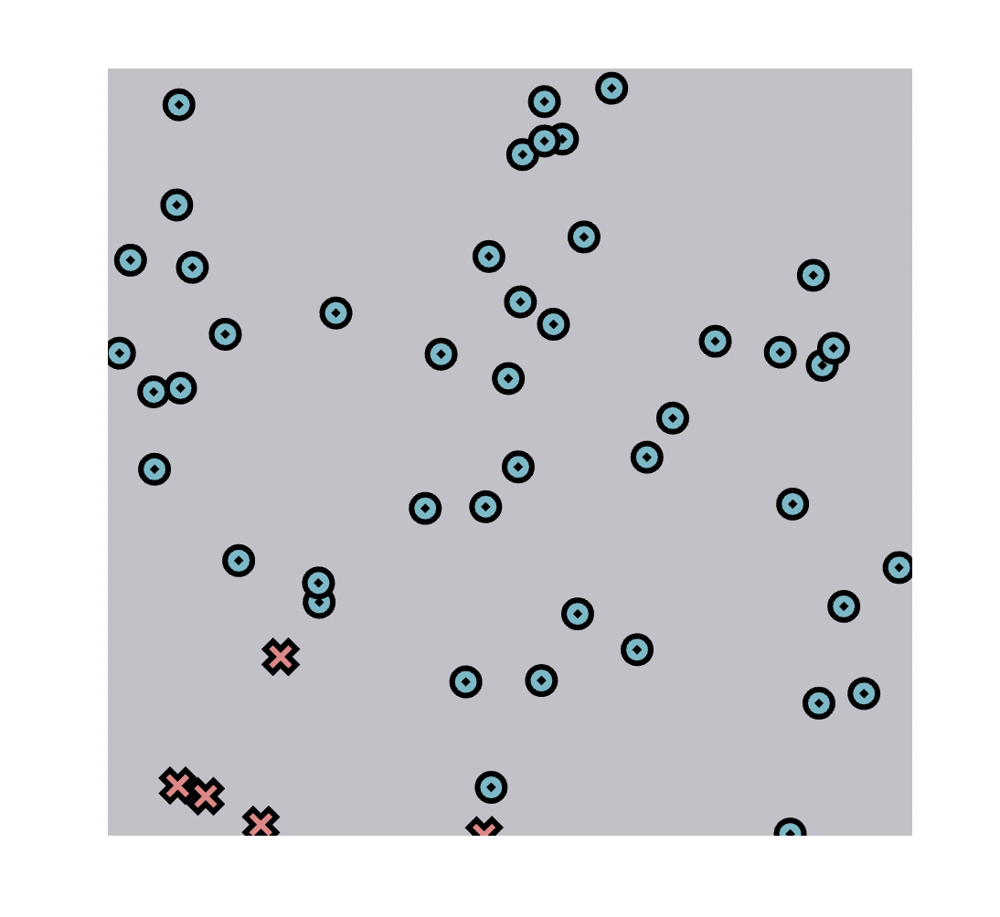

### Trained Results

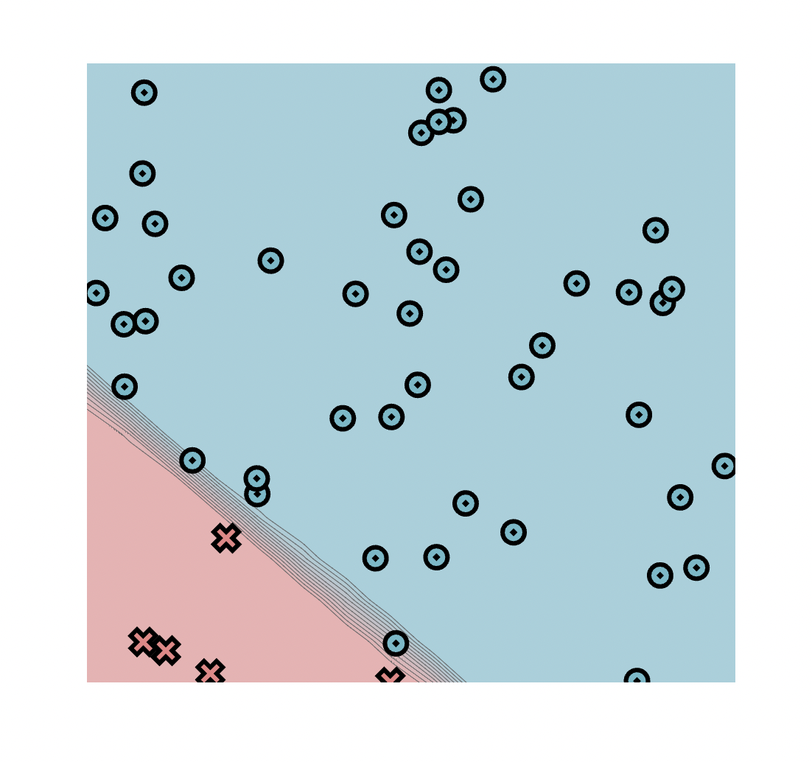

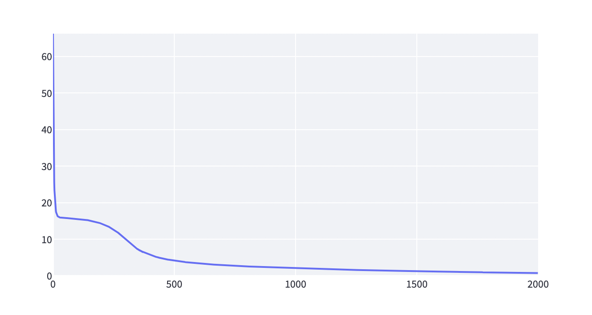


### Logs
```
Epoch: 0/2000, loss: 0, correct: 0
Epoch: 10/2000, loss: 19.48726365957854, correct: 45
Epoch: 20/2000, loss: 16.348106039110398, correct: 45
Epoch: 30/2000, loss: 15.974817408114255, correct: 45
Epoch: 40/2000, loss: 15.895096883189037, correct: 45
Epoch: 50/2000, loss: 15.853213771792026, correct: 45
Epoch: 60/2000, loss: 15.813720197675249, correct: 45
Epoch: 70/2000, loss: 15.7708827937184, correct: 45
Epoch: 80/2000, loss: 15.723295522930353, correct: 45
Epoch: 90/2000, loss: 15.670114387752898, correct: 45
Epoch: 100/2000, loss: 15.610469196992527, correct: 45
Epoch: 110/2000, loss: 15.543329823442527, correct: 45
Epoch: 120/2000, loss: 15.467497474435794, correct: 45
Epoch: 130/2000, loss: 15.38154683630707, correct: 45
Epoch: 140/2000, loss: 15.283791241941447, correct: 45
Epoch: 150/2000, loss: 15.17221025925512, correct: 45
Epoch: 160/2000, loss: 15.044393740617627, correct: 45
Epoch: 170/2000, loss: 14.898600235160524, correct: 45
Epoch: 180/2000, loss: 14.73153804283898, correct: 45
Epoch: 190/2000, loss: 14.539865058688983, correct: 45
Epoch: 200/2000, loss: 14.31844457049775, correct: 45
Epoch: 210/2000, loss: 14.068948271399776, correct: 45
Epoch: 220/2000, loss: 13.787439013234083, correct: 45
Epoch: 230/2000, loss: 13.470851550504884, correct: 45
Epoch: 240/2000, loss: 13.117999337857032, correct: 45
Epoch: 250/2000, loss: 12.716198677022039, correct: 45
Epoch: 260/2000, loss: 12.26814195422128, correct: 45
Epoch: 270/2000, loss: 11.777806855839192, correct: 45
Epoch: 280/2000, loss: 11.244341433084587, correct: 45
Epoch: 290/2000, loss: 10.683309616032606, correct: 45
Epoch: 300/2000, loss: 10.091287671902355, correct: 45
Epoch: 310/2000, loss: 9.466875379795077, correct: 45
Epoch: 320/2000, loss: 8.852157183295027, correct: 45
Epoch: 330/2000, loss: 8.25337031428833, correct: 45
Epoch: 340/2000, loss: 7.710277415989268, correct: 45
Epoch: 350/2000, loss: 7.33284739695798, correct: 45
Epoch: 360/2000, loss: 6.900785039347391, correct: 45
Epoch: 370/2000, loss: 6.561485621992055, correct: 48
Epoch: 380/2000, loss: 6.294644278191456, correct: 48
Epoch: 390/2000, loss: 6.067499321712338, correct: 48
Epoch: 400/2000, loss: 5.757279325591353, correct: 48
Epoch: 410/2000, loss: 5.542199987401281, correct: 48
Epoch: 420/2000, loss: 5.331379181464956, correct: 48
Epoch: 430/2000, loss: 5.138932735326348, correct: 48
Epoch: 440/2000, loss: 4.965962102396593, correct: 48
Epoch: 450/2000, loss: 4.80968747414394, correct: 48
Epoch: 460/2000, loss: 4.665568697692098, correct: 48
Epoch: 470/2000, loss: 4.533427543461048, correct: 48
Epoch: 480/2000, loss: 4.411389561619382, correct: 48
Epoch: 490/2000, loss: 4.298235243973663, correct: 48
Epoch: 500/2000, loss: 4.192931218911906, correct: 48
Epoch: 510/2000, loss: 4.094597992436209, correct: 48
Epoch: 520/2000, loss: 4.002477417052319, correct: 49
Epoch: 530/2000, loss: 3.9159164660643766, correct: 49
Epoch: 540/2000, loss: 3.8343525742954703, correct: 49
Epoch: 550/2000, loss: 3.757297617023263, correct: 49
Epoch: 560/2000, loss: 3.6843263619058524, correct: 49
Epoch: 570/2000, loss: 3.615066883644913, correct: 49
Epoch: 580/2000, loss: 3.549192591887214, correct: 49
Epoch: 590/2000, loss: 3.4864163694857644, correct: 49
Epoch: 600/2000, loss: 3.426483599728722, correct: 49
Epoch: 610/2000, loss: 3.3691669943050595, correct: 49
Epoch: 620/2000, loss: 3.314264359307959, correct: 49
Epoch: 630/2000, loss: 3.2615952565433908, correct: 49
Epoch: 640/2000, loss: 3.2109976687025017, correct: 49
Epoch: 650/2000, loss: 3.162325621218647, correct: 49
Epoch: 660/2000, loss: 3.1154471571365745, correct: 49
Epoch: 670/2000, loss: 3.07024260774637, correct: 49
Epoch: 680/2000, loss: 3.026603111793159, correct: 49
Epoch: 690/2000, loss: 2.9844293442212573, correct: 49
Epoch: 700/2000, loss: 2.9436304220385825, correct: 49
Epoch: 710/2000, loss: 2.9041229602957253, correct: 49
Epoch: 720/2000, loss: 2.8658302556043225, correct: 49
Epoch: 730/2000, loss: 2.8286815782622963, correct: 49
Epoch: 740/2000, loss: 2.792611557060734, correct: 49
Epoch: 750/2000, loss: 2.75755964333892, correct: 49
Epoch: 760/2000, loss: 2.72346964292665, correct: 49
Epoch: 770/2000, loss: 2.690289306342864, correct: 49
Epoch: 780/2000, loss: 2.6579699690683984, correct: 49
Epoch: 790/2000, loss: 2.626466234927822, correct: 49
Epoch: 800/2000, loss: 2.595735696640614, correct: 49
Epoch: 810/2000, loss: 2.565738688468111, correct: 49
Epoch: 820/2000, loss: 2.5364380666159785, correct: 49
Epoch: 830/2000, loss: 2.507799013674166, correct: 49
Epoch: 840/2000, loss: 2.4797888639053642, correct: 49
Epoch: 850/2000, loss: 2.4523769466435046, correct: 49
Epoch: 860/2000, loss: 2.4255344454483154, correct: 49
Epoch: 870/2000, loss: 2.399234270990334, correct: 49
Epoch: 880/2000, loss: 2.373450945921926, correct: 49
Epoch: 890/2000, loss: 2.348160565970422, correct: 49
Epoch: 900/2000, loss: 2.3233405705758083, correct: 49
Epoch: 910/2000, loss: 2.2989696285836385, correct: 49
Epoch: 920/2000, loss: 2.2750277567083432, correct: 49
Epoch: 930/2000, loss: 2.251496140871856, correct: 49
Epoch: 940/2000, loss: 2.2283570678430933, correct: 49
Epoch: 950/2000, loss: 2.2055938617813737, correct: 49
Epoch: 960/2000, loss: 2.183190834955876, correct: 49
Epoch: 970/2000, loss: 2.1611332190217936, correct: 49
Epoch: 980/2000, loss: 2.1394070892613484, correct: 49
Epoch: 990/2000, loss: 2.1179993664641774, correct: 49
Epoch: 1000/2000, loss: 2.0968977485043805, correct: 49
Epoch: 1010/2000, loss: 2.076090667268878, correct: 49
Epoch: 1020/2000, loss: 2.0555672479543157, correct: 49
Epoch: 1030/2000, loss: 2.035317270539054, correct: 49
Epoch: 1040/2000, loss: 2.0153311332627903, correct: 49
Epoch: 1050/2000, loss: 1.995599817968736, correct: 49
Epoch: 1060/2000, loss: 1.9761148571823108, correct: 49
Epoch: 1070/2000, loss: 1.9568683028166831, correct: 50
Epoch: 1080/2000, loss: 1.93785269640923, correct: 50
Epoch: 1090/2000, loss: 1.9190610408046818, correct: 50
Epoch: 1100/2000, loss: 1.9004867732105288, correct: 50
Epoch: 1110/2000, loss: 1.882123739558415, correct: 50
Epoch: 1120/2000, loss: 1.8639661822893419, correct: 50
Epoch: 1130/2000, loss: 1.8460086844926322, correct: 50
Epoch: 1140/2000, loss: 1.8282461684388942, correct: 50
Epoch: 1150/2000, loss: 1.8106738835151928, correct: 50
Epoch: 1160/2000, loss: 1.7932873771979085, correct: 50
Epoch: 1170/2000, loss: 1.7760824761801615, correct: 50
Epoch: 1180/2000, loss: 1.7590552684728782, correct: 50
Epoch: 1190/2000, loss: 1.742202086442672, correct: 50
Epoch: 1200/2000, loss: 1.7255194907508418, correct: 50
Epoch: 1210/2000, loss: 1.709004255158702, correct: 50
Epoch: 1220/2000, loss: 1.6926533521652078, correct: 50
Epoch: 1230/2000, loss: 1.6764639394434475, correct: 50
Epoch: 1240/2000, loss: 1.6604333470431532, correct: 50
Epoch: 1250/2000, loss: 1.6445590653269062, correct: 50
Epoch: 1260/2000, loss: 1.6288387336082115, correct: 50
Epoch: 1270/2000, loss: 1.6132701294601903, correct: 50
Epoch: 1280/2000, loss: 1.5978511586641857, correct: 50
Epoch: 1290/2000, loss: 1.5825798457681854, correct: 50
Epoch: 1300/2000, loss: 1.5674543252256687, correct: 50
Epoch: 1310/2000, loss: 1.5524728330861342, correct: 50
Epoch: 1320/2000, loss: 1.5376336992093913, correct: 50
Epoch: 1330/2000, loss: 1.5229353399764975, correct: 50
Epoch: 1340/2000, loss: 1.508376251471043, correct: 50
Epoch: 1350/2000, loss: 1.493955003105441, correct: 50
Epoch: 1360/2000, loss: 1.4796702316677492, correct: 50
Epoch: 1370/2000, loss: 1.4655206357655663, correct: 50
Epoch: 1380/2000, loss: 1.4515049706444183, correct: 50
Epoch: 1390/2000, loss: 1.4376220433591338, correct: 50
Epoch: 1400/2000, loss: 1.4238707082775746, correct: 50
Epoch: 1410/2000, loss: 1.4102498628971651, correct: 50
Epoch: 1420/2000, loss: 1.396758443955508, correct: 50
Epoch: 1430/2000, loss: 1.3833954238174135, correct: 50
Epoch: 1440/2000, loss: 1.3701598071215353, correct: 50
Epoch: 1450/2000, loss: 1.3570506276707264, correct: 50
Epoch: 1460/2000, loss: 1.3440669455510603, correct: 50
Epoch: 1470/2000, loss: 1.331207844465342, correct: 50
Epoch: 1480/2000, loss: 1.3184724292677048, correct: 50
Epoch: 1490/2000, loss: 1.3058598236866574, correct: 50
Epoch: 1500/2000, loss: 1.293369168224712, correct: 50
Epoch: 1510/2000, loss: 1.2809996182233485, correct: 50
Epoch: 1520/2000, loss: 1.2687503420828288, correct: 50
Epoch: 1530/2000, loss: 1.256620519626909, correct: 50
Epoch: 1540/2000, loss: 1.244609340603158, correct: 50
Epoch: 1550/2000, loss: 1.232716003310109, correct: 50
Epoch: 1560/2000, loss: 1.2209397133430109, correct: 50
Epoch: 1570/2000, loss: 1.2092796824504646, correct: 50
Epoch: 1580/2000, loss: 1.1977351274946388, correct: 50
Epoch: 1590/2000, loss: 1.1863052695082816, correct: 50
Epoch: 1600/2000, loss: 1.1749893328420602, correct: 50
Epoch: 1610/2000, loss: 1.1637865443962399, correct: 50
Epoch: 1620/2000, loss: 1.152696132931021, correct: 50
Epoch: 1630/2000, loss: 1.1417173284501965, correct: 50
Epoch: 1640/2000, loss: 1.1308493616531323, correct: 50
Epoch: 1650/2000, loss: 1.1200914634503878, correct: 50
Epoch: 1660/2000, loss: 1.109442864538503, correct: 50
Epoch: 1670/2000, loss: 1.0989027950298438, correct: 50
Epoch: 1680/2000, loss: 1.0884704841335697, correct: 50
Epoch: 1690/2000, loss: 1.0781451598840466, correct: 50
Epoch: 1700/2000, loss: 1.067926048913264, correct: 50
Epoch: 1710/2000, loss: 1.0578123762639915, correct: 50
Epoch: 1720/2000, loss: 1.047803365240617, correct: 50
Epoch: 1730/2000, loss: 1.0378982372948151, correct: 50
Epoch: 1740/2000, loss: 1.0280962119433141, correct: 50
Epoch: 1750/2000, loss: 1.0183965067152352, correct: 50
Epoch: 1760/2000, loss: 1.0087983371266298, correct: 50
Epoch: 1770/2000, loss: 0.9993009166799409, correct: 50
Epoch: 1780/2000, loss: 0.9899034568863179, correct: 50
Epoch: 1790/2000, loss: 0.9806051673087505, correct: 50
Epoch: 1800/2000, loss: 0.9714052556242324, correct: 50
Epoch: 1810/2000, loss: 0.9623029277031352, correct: 50
Epoch: 1820/2000, loss: 0.953297387704203, correct: 50
Epoch: 1830/2000, loss: 0.9443878381836098, correct: 50
Epoch: 1840/2000, loss: 0.935573480216635, correct: 50
Epoch: 1850/2000, loss: 0.9268535135306178, correct: 50
Epoch: 1860/2000, loss: 0.9182271366479, correct: 50
Epoch: 1870/2000, loss: 0.9096935470375935, correct: 50
Epoch: 1880/2000, loss: 0.9012519412750521, correct: 50
Epoch: 1890/2000, loss: 0.8929015152080102, correct: 50
Epoch: 1900/2000, loss: 0.8846414641284083, correct: 50
Epoch: 1910/2000, loss: 0.8764709829490257, correct: 50
Epoch: 1920/2000, loss: 0.8683892663840438, correct: 50
Epoch: 1930/2000, loss: 0.8603955091327723, correct: 50
Epoch: 1940/2000, loss: 0.8524889060658024, correct: 50
Epoch: 1950/2000, loss: 0.8446686524129008, correct: 50
Epoch: 1960/2000, loss: 0.8369339439520109, correct: 50
Epoch: 1970/2000, loss: 0.8292839771987929, correct: 50
Epoch: 1980/2000, loss: 0.8217179495961243, correct: 50
Epoch: 1990/2000, loss: 0.8142350597030998, correct: 50
Epoch: 2000/2000, loss: 0.8068345073830323, correct: 50
```

## Split Data Set

### Parameters
- 50 points
- 6 hidden layers
- 5.0 Learning Rate
- 2000 epochs

### Initial Setting

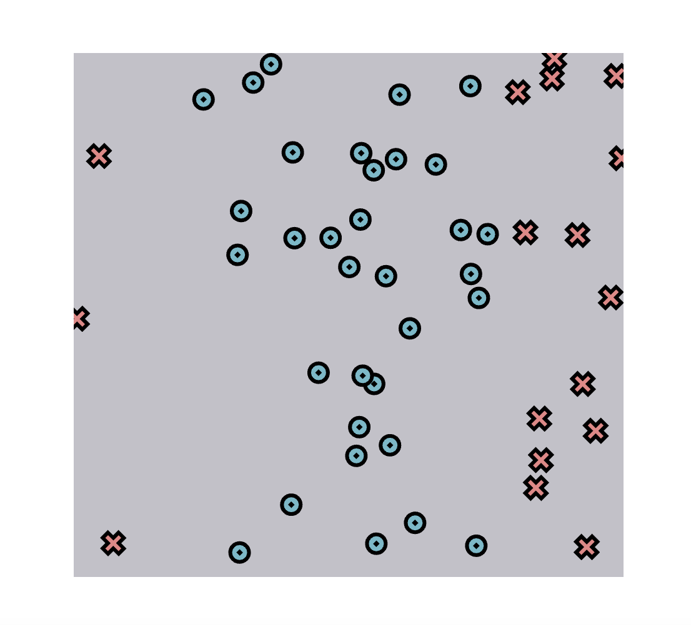

### Trained Results

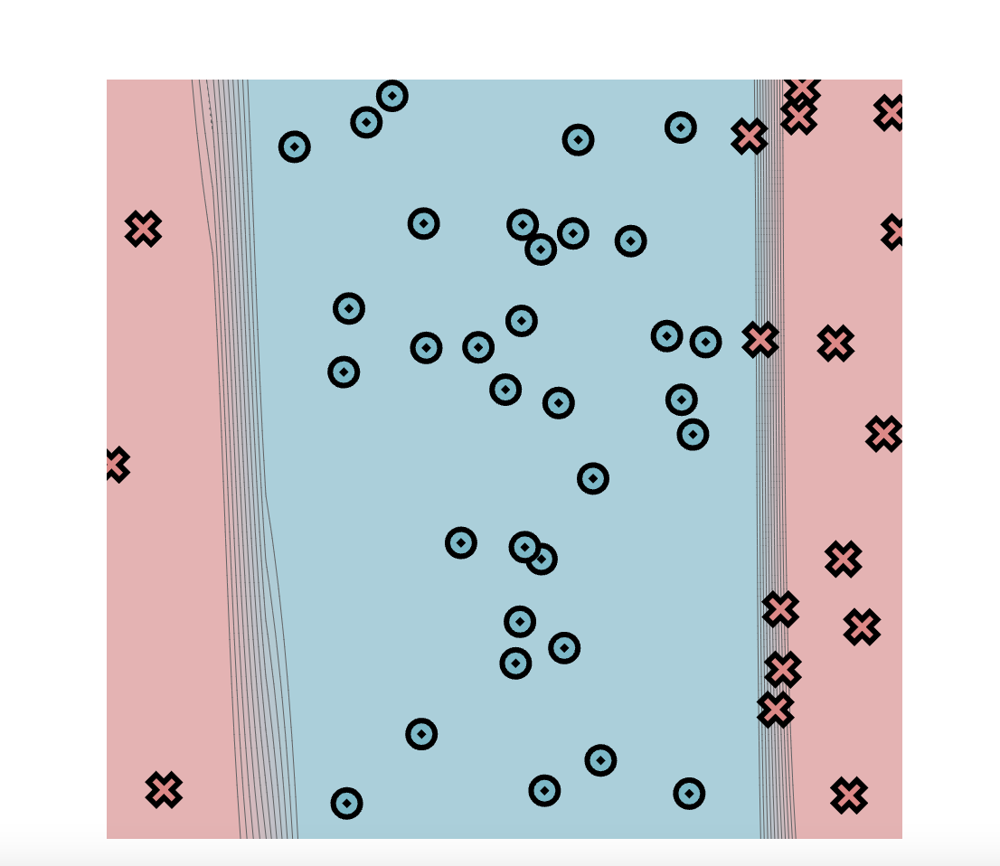


### Logs

```
Epoch: 0/2000, loss: 0, correct: 0
Epoch: 10/2000, loss: 32.0908404666406, correct: 33
Epoch: 20/2000, loss: 32.08609316020129, correct: 33
Epoch: 30/2000, loss: 32.0819161111269, correct: 33
Epoch: 40/2000, loss: 32.07820366950463, correct: 33
Epoch: 50/2000, loss: 32.07486886186053, correct: 33
Epoch: 60/2000, loss: 32.07183903375255, correct: 33
Epoch: 70/2000, loss: 32.069052505957444, correct: 33
Epoch: 80/2000, loss: 32.06645596393006, correct: 33
Epoch: 90/2000, loss: 32.064002378875735, correct: 33
Epoch: 100/2000, loss: 32.0616493123806, correct: 33
Epoch: 110/2000, loss: 32.05935749316181, correct: 33
Epoch: 120/2000, loss: 32.05708957931382, correct: 33
Epoch: 130/2000, loss: 32.054809035763874, correct: 33
Epoch: 140/2000, loss: 32.05247906661798, correct: 33
Epoch: 150/2000, loss: 32.05006154692756, correct: 33
Epoch: 160/2000, loss: 32.047515898766854, correct: 33
Epoch: 170/2000, loss: 32.04479785247956, correct: 33
Epoch: 180/2000, loss: 32.04185802514887, correct: 33
Epoch: 190/2000, loss: 32.03864023383516, correct: 33
Epoch: 200/2000, loss: 32.03507943931981, correct: 33
Epoch: 210/2000, loss: 32.03109918450133, correct: 33
Epoch: 220/2000, loss: 32.02660834644915, correct: 33
Epoch: 230/2000, loss: 32.02149695681672, correct: 33
Epoch: 240/2000, loss: 32.01577401515836, correct: 33
Epoch: 250/2000, loss: 32.00916956569985, correct: 33
Epoch: 260/2000, loss: 32.00149016697266, correct: 33
Epoch: 270/2000, loss: 31.992491998975236, correct: 33
Epoch: 280/2000, loss: 31.981866762383344, correct: 33
Epoch: 290/2000, loss: 31.969219336026057, correct: 33
Epoch: 300/2000, loss: 31.954036771211097, correct: 33
Epoch: 310/2000, loss: 31.93564709842267, correct: 33
Epoch: 320/2000, loss: 31.913681417073335, correct: 33
Epoch: 330/2000, loss: 31.885971601486002, correct: 33
Epoch: 340/2000, loss: 31.85213627165397, correct: 33
Epoch: 350/2000, loss: 31.809555612982813, correct: 33
Epoch: 360/2000, loss: 31.755328410221, correct: 33
Epoch: 370/2000, loss: 31.68537758629166, correct: 33
Epoch: 380/2000, loss: 31.594130364208866, correct: 33
Epoch: 390/2000, loss: 31.475526579233666, correct: 33
Epoch: 400/2000, loss: 31.31953935579206, correct: 33
Epoch: 410/2000, loss: 31.10610440998039, correct: 33
Epoch: 420/2000, loss: 30.878632771484078, correct: 33
Epoch: 430/2000, loss: 30.477010071261443, correct: 33
Epoch: 440/2000, loss: 29.718327893064288, correct: 33
Epoch: 450/2000, loss: 30.779756520021778, correct: 33
Epoch: 460/2000, loss: 33.13083837079319, correct: 33
Epoch: 470/2000, loss: 33.29943438555225, correct: 33
Epoch: 480/2000, loss: 32.95495332028757, correct: 33
Epoch: 490/2000, loss: 32.765328201830606, correct: 33
Epoch: 500/2000, loss: 32.95134893994129, correct: 33
Epoch: 510/2000, loss: 33.15630587215068, correct: 33
Epoch: 520/2000, loss: 33.1423563353546, correct: 33
Epoch: 530/2000, loss: 32.48173953066917, correct: 33
Epoch: 540/2000, loss: 32.773274054766915, correct: 33
Epoch: 550/2000, loss: 32.15659285548021, correct: 33
Epoch: 560/2000, loss: 31.912910594510727, correct: 33
Epoch: 570/2000, loss: 32.220779038066134, correct: 33
Epoch: 580/2000, loss: 31.792746206925905, correct: 33
Epoch: 590/2000, loss: 31.24701798510917, correct: 33
Epoch: 600/2000, loss: 30.78633113552555, correct: 33
Epoch: 610/2000, loss: 30.322429576719962, correct: 33
Epoch: 620/2000, loss: 29.13810513785628, correct: 33
Epoch: 630/2000, loss: 28.88650401607219, correct: 34
Epoch: 640/2000, loss: 27.577129955232955, correct: 36
Epoch: 650/2000, loss: 25.583845204619337, correct: 38
Epoch: 660/2000, loss: 24.741380194106046, correct: 39
Epoch: 670/2000, loss: 24.646378429807495, correct: 39
Epoch: 680/2000, loss: 21.08186117211937, correct: 40
Epoch: 690/2000, loss: 22.00933305165923, correct: 40
Epoch: 700/2000, loss: 22.277058074693862, correct: 40
Epoch: 710/2000, loss: 19.159836688023475, correct: 40
Epoch: 720/2000, loss: 17.607620496949075, correct: 43
Epoch: 730/2000, loss: 22.258545058618584, correct: 40
Epoch: 740/2000, loss: 22.175479420300046, correct: 40
Epoch: 750/2000, loss: 15.635515881166388, correct: 45
Epoch: 760/2000, loss: 15.521031445933174, correct: 45
Epoch: 770/2000, loss: 22.703746798905197, correct: 40
Epoch: 780/2000, loss: 18.91609679556404, correct: 41
Epoch: 790/2000, loss: 14.723534613889614, correct: 45
Epoch: 800/2000, loss: 17.139081611320595, correct: 42
Epoch: 810/2000, loss: 21.038106420486688, correct: 40
Epoch: 820/2000, loss: 15.859926740261251, correct: 44
Epoch: 830/2000, loss: 16.547260096240482, correct: 42
Epoch: 840/2000, loss: 19.13496784807733, correct: 40
Epoch: 850/2000, loss: 16.72955127095597, correct: 42
Epoch: 860/2000, loss: 16.155886486156632, correct: 42
Epoch: 870/2000, loss: 18.260983194060206, correct: 40
Epoch: 880/2000, loss: 16.590426969749032, correct: 42
Epoch: 890/2000, loss: 16.26450191399411, correct: 42
Epoch: 900/2000, loss: 16.758945329872475, correct: 41
Epoch: 910/2000, loss: 15.774740926770866, correct: 42
Epoch: 920/2000, loss: 15.604440690831812, correct: 41
Epoch: 930/2000, loss: 14.980064395529283, correct: 42
Epoch: 940/2000, loss: 14.464932883070498, correct: 42
Epoch: 950/2000, loss: 13.853738194229205, correct: 42
Epoch: 960/2000, loss: 13.049743694722615, correct: 42
Epoch: 970/2000, loss: 12.38848887965979, correct: 42
Epoch: 980/2000, loss: 11.368643630196626, correct: 42
Epoch: 990/2000, loss: 10.864527786935295, correct: 43
Epoch: 1000/2000, loss: 10.892942328265132, correct: 43
Epoch: 1010/2000, loss: 9.292659133762571, correct: 44
Epoch: 1020/2000, loss: 3.2991207751916676, correct: 49
Epoch: 1030/2000, loss: 2.0390595789495864, correct: 50
Epoch: 1040/2000, loss: 1.7719007932349733, correct: 50
Epoch: 1050/2000, loss: 1.5622148218594936, correct: 50
Epoch: 1060/2000, loss: 1.3937122454885766, correct: 50
Epoch: 1070/2000, loss: 1.2553485482793096, correct: 50
Epoch: 1080/2000, loss: 1.1399278847951484, correct: 50
Epoch: 1090/2000, loss: 1.0423141471018278, correct: 50
Epoch: 1100/2000, loss: 0.9588061527515862, correct: 50
Epoch: 1110/2000, loss: 0.8866514964560622, correct: 50
Epoch: 1120/2000, loss: 0.8237690838615863, correct: 50
Epoch: 1130/2000, loss: 0.7685301792690157, correct: 50
Epoch: 1140/2000, loss: 0.7196807807716548, correct: 50
Epoch: 1150/2000, loss: 0.6762063702881567, correct: 50
Epoch: 1160/2000, loss: 0.6372891583337811, correct: 50
Epoch: 1170/2000, loss: 0.6022727318063092, correct: 50
Epoch: 1180/2000, loss: 0.5706165272516649, correct: 50
Epoch: 1190/2000, loss: 0.5418744245582701, correct: 50
Epoch: 1200/2000, loss: 0.5156745569565373, correct: 50
Epoch: 1210/2000, loss: 0.491705257646282, correct: 50
Epoch: 1220/2000, loss: 0.46970042283963237, correct: 50
Epoch: 1230/2000, loss: 0.44943522444734385, correct: 50
Epoch: 1240/2000, loss: 0.4307172745358329, correct: 50
Epoch: 1250/2000, loss: 0.4133810676972618, correct: 50
Epoch: 1260/2000, loss: 0.39728347863409874, correct: 50
Epoch: 1270/2000, loss: 0.38230016075587536, correct: 50
Epoch: 1280/2000, loss: 0.3683226015179351, correct: 50
Epoch: 1290/2000, loss: 0.35525569564558, correct: 50
Epoch: 1300/2000, loss: 0.3430157780509344, correct: 50
Epoch: 1310/2000, loss: 0.3315289555715597, correct: 50
Epoch: 1320/2000, loss: 0.32072975147581806, correct: 50
Epoch: 1330/2000, loss: 0.3105599400428207, correct: 50
Epoch: 1340/2000, loss: 0.3009675909543709, correct: 50
Epoch: 1350/2000, loss: 0.29190790536799127, correct: 50
Epoch: 1360/2000, loss: 0.2834067404841293, correct: 50
Epoch: 1370/2000, loss: 0.27540742086287895, correct: 50
Epoch: 1380/2000, loss: 0.2678134298548594, correct: 50
Epoch: 1390/2000, loss: 0.26059377946596646, correct: 50
Epoch: 1400/2000, loss: 0.25372228138373903, correct: 50
Epoch: 1410/2000, loss: 0.24717509819702824, correct: 50
Epoch: 1420/2000, loss: 0.2409304863436643, correct: 50
Epoch: 1430/2000, loss: 0.2349685732658844, correct: 50
Epoch: 1440/2000, loss: 0.2292711622685997, correct: 50
Epoch: 1450/2000, loss: 0.22382156115871887, correct: 50
Epoch: 1460/2000, loss: 0.2186044313645823, correct: 50
Epoch: 1470/2000, loss: 0.2136056547466165, correct: 50
Epoch: 1480/2000, loss: 0.20881221573503222, correct: 50
Epoch: 1490/2000, loss: 0.2042120967837824, correct: 50
Epoch: 1500/2000, loss: 0.19979418542512503, correct: 50
Epoch: 1510/2000, loss: 0.19554819145651037, correct: 50
Epoch: 1520/2000, loss: 0.19146457299956596, correct: 50
Epoch: 1530/2000, loss: 0.18753447034638826, correct: 50
Epoch: 1540/2000, loss: 0.18374964665698829, correct: 50
Epoch: 1550/2000, loss: 0.18010243469771706, correct: 50
Epoch: 1560/2000, loss: 0.17658568891787874, correct: 50
Epoch: 1570/2000, loss: 0.17319274225340733, correct: 50
Epoch: 1580/2000, loss: 0.1699173671248059, correct: 50
Epoch: 1590/2000, loss: 0.16675374016397682, correct: 50
Epoch: 1600/2000, loss: 0.16369641026241022, correct: 50
Epoch: 1610/2000, loss: 0.16074026958320245, correct: 50
Epoch: 1620/2000, loss: 0.15788052722246143, correct: 50
Epoch: 1630/2000, loss: 0.15511273761362623, correct: 50
Epoch: 1640/2000, loss: 0.15243271416160598, correct: 50
Epoch: 1650/2000, loss: 0.14983637245116171, correct: 50
Epoch: 1660/2000, loss: 0.14731997146348233, correct: 50
Epoch: 1670/2000, loss: 0.14488223776364498, correct: 50
Epoch: 1680/2000, loss: 0.14251740539842137, correct: 50
Epoch: 1690/2000, loss: 0.1402249333185293, correct: 50
Epoch: 1700/2000, loss: 0.13800108694185562, correct: 50
Epoch: 1710/2000, loss: 0.13583214736242488, correct: 50
Epoch: 1720/2000, loss: 0.13373120562686777, correct: 50
Epoch: 1730/2000, loss: 0.131689419084274, correct: 50
Epoch: 1740/2000, loss: 0.12970436570404828, correct: 50
Epoch: 1750/2000, loss: 0.1277737687094412, correct: 50
Epoch: 1760/2000, loss: 0.1258954715151363, correct: 50
Epoch: 1770/2000, loss: 0.12406742920297635, correct: 50
Epoch: 1780/2000, loss: 0.1222877012777244, correct: 50
Epoch: 1790/2000, loss: 0.12055444506552701, correct: 50
Epoch: 1800/2000, loss: 0.11886590962246026, correct: 50
Epoch: 1810/2000, loss: 0.11722043009714, correct: 50
Epoch: 1820/2000, loss: 0.11561642250645263, correct: 50
Epoch: 1830/2000, loss: 0.1140523788889972, correct: 50
Epoch: 1840/2000, loss: 0.11252525840731874, correct: 50
Epoch: 1850/2000, loss: 0.11103572249570964, correct: 50
Epoch: 1860/2000, loss: 0.10958356162564674, correct: 50
Epoch: 1870/2000, loss: 0.10816163035960225, correct: 50
Epoch: 1880/2000, loss: 0.10677905778924891, correct: 50
Epoch: 1890/2000, loss: 0.10542821785077489, correct: 50
Epoch: 1900/2000, loss: 0.1041036470175589, correct: 50
Epoch: 1910/2000, loss: 0.10281290862857194, correct: 50
Epoch: 1920/2000, loss: 0.10155435115762498, correct: 50
Epoch: 1930/2000, loss: 0.10031809765887587, correct: 50
Epoch: 1940/2000, loss: 0.09911128622965784, correct: 50
Epoch: 1950/2000, loss: 0.09793162640582895, correct: 50
Epoch: 1960/2000, loss: 0.09677744376299399, correct: 50
Epoch: 1970/2000, loss: 0.09564737873857915, correct: 50
Epoch: 1980/2000, loss: 0.09454211692831004, correct: 50
Epoch: 1990/2000, loss: 0.0934601878543782, correct: 50
Epoch: 2000/2000, loss: 0.09240087489918829, correct: 50
```

## Xor Data Set

### Parameters
- 50 points
- 6 hidden layers
- 5.0 Learning Rate
- 4000 epochs

### Initial Setting

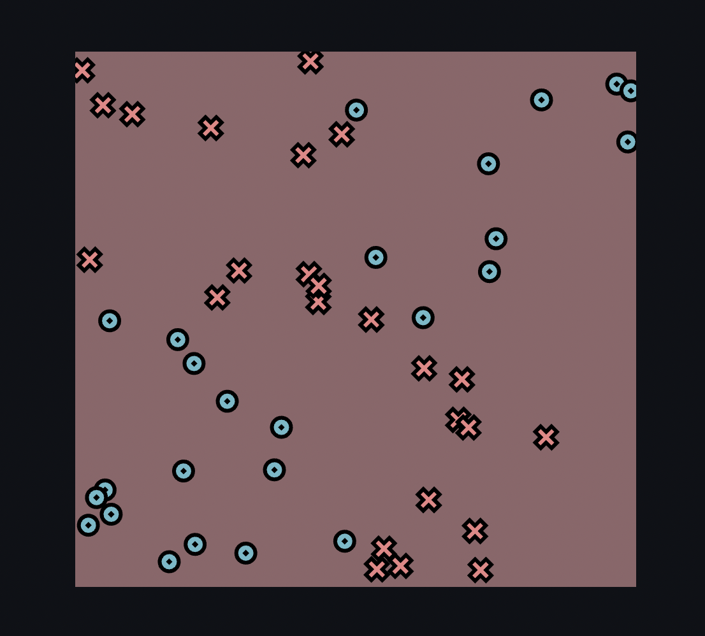

### Trained Results

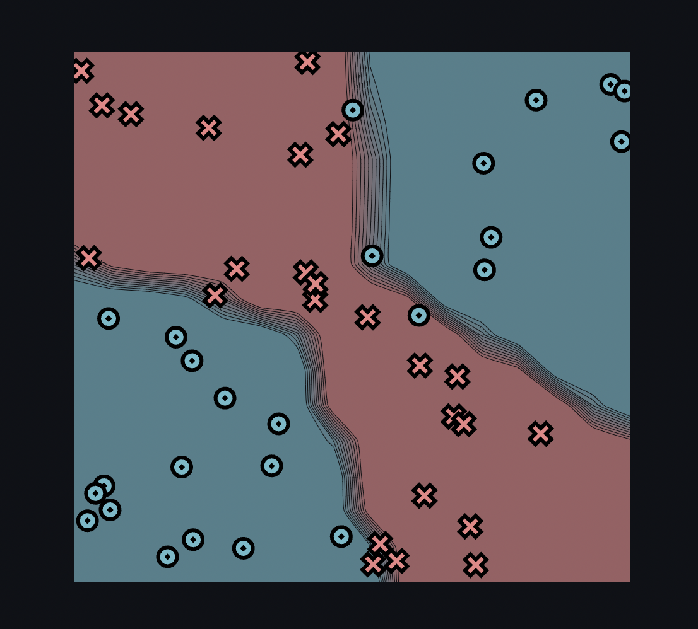

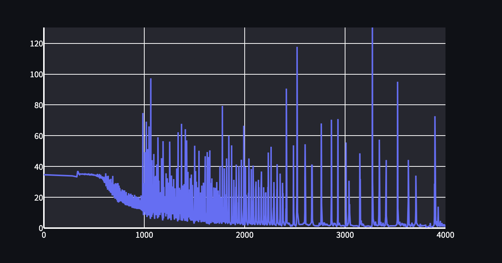


### Logs

```
Epoch: 0/4000, loss: 0, correct: 0
Epoch: 10/4000, loss: 34.64517091709012, correct: 23
Epoch: 20/4000, loss: 34.64292732096315, correct: 26
Epoch: 30/4000, loss: 34.64034834434808, correct: 26
Epoch: 40/4000, loss: 34.635480152500634, correct: 27
Epoch: 50/4000, loss: 34.624337635525166, correct: 28
Epoch: 60/4000, loss: 34.61334461237815, correct: 29
Epoch: 70/4000, loss: 34.60643184887766, correct: 34
Epoch: 80/4000, loss: 34.60086802865534, correct: 33
Epoch: 90/4000, loss: 34.59497234978853, correct: 34
Epoch: 100/4000, loss: 34.588364989380544, correct: 34
Epoch: 110/4000, loss: 34.58092739766813, correct: 34
Epoch: 120/4000, loss: 34.57250058753297, correct: 34
Epoch: 130/4000, loss: 34.5629449282298, correct: 33
Epoch: 140/4000, loss: 34.55230925265752, correct: 34
Epoch: 150/4000, loss: 34.54033357348377, correct: 34
Epoch: 160/4000, loss: 34.52648799233603, correct: 34
Epoch: 170/4000, loss: 34.51036800658787, correct: 34
Epoch: 180/4000, loss: 34.49199204504233, correct: 34
Epoch: 190/4000, loss: 34.47035847981737, correct: 33
Epoch: 200/4000, loss: 34.44513071874356, correct: 34
Epoch: 210/4000, loss: 34.41538139533578, correct: 34
Epoch: 220/4000, loss: 34.3802588671747, correct: 33
Epoch: 230/4000, loss: 34.338858543276, correct: 34
Epoch: 240/4000, loss: 34.28853927486327, correct: 34
Epoch: 250/4000, loss: 34.227009913422386, correct: 34
Epoch: 260/4000, loss: 34.153629637470765, correct: 34
Epoch: 270/4000, loss: 34.062638153306565, correct: 34
Epoch: 280/4000, loss: 33.95195950733308, correct: 34
Epoch: 290/4000, loss: 33.813824557824724, correct: 34
Epoch: 300/4000, loss: 33.643732291124415, correct: 33
Epoch: 310/4000, loss: 33.43118832354211, correct: 33
Epoch: 320/4000, loss: 33.186861868400015, correct: 32
Epoch: 330/4000, loss: 33.535217544072914, correct: 28
Epoch: 340/4000, loss: 36.86813305003499, correct: 25
Epoch: 350/4000, loss: 35.215719347644075, correct: 25
Epoch: 360/4000, loss: 35.13180988403597, correct: 26
Epoch: 370/4000, loss: 35.118998274805854, correct: 26
Epoch: 380/4000, loss: 35.08507883594538, correct: 26
Epoch: 390/4000, loss: 35.07556041437467, correct: 27
Epoch: 400/4000, loss: 34.92370170663655, correct: 27
Epoch: 410/4000, loss: 34.715077122720075, correct: 28
Epoch: 420/4000, loss: 35.31987101978708, correct: 27
Epoch: 430/4000, loss: 35.297908204049506, correct: 28
Epoch: 440/4000, loss: 35.19445791208991, correct: 28
Epoch: 450/4000, loss: 35.248381784506954, correct: 28
Epoch: 460/4000, loss: 34.53450254223624, correct: 28
Epoch: 470/4000, loss: 34.43582586846599, correct: 28
Epoch: 480/4000, loss: 35.26434558938554, correct: 28
Epoch: 490/4000, loss: 34.32450485860027, correct: 29
Epoch: 500/4000, loss: 34.481888557255665, correct: 29
Epoch: 510/4000, loss: 34.03991273154375, correct: 29
Epoch: 520/4000, loss: 34.17269727969802, correct: 29
Epoch: 530/4000, loss: 33.780699844298866, correct: 29
Epoch: 540/4000, loss: 33.87893097668949, correct: 29
Epoch: 550/4000, loss: 32.90001941342152, correct: 29
Epoch: 560/4000, loss: 33.32973999494887, correct: 29
Epoch: 570/4000, loss: 32.401732225436355, correct: 29
Epoch: 580/4000, loss: 32.60003039939083, correct: 29
Epoch: 590/4000, loss: 31.53132986206034, correct: 29
Epoch: 600/4000, loss: 30.837537957188662, correct: 29
Epoch: 610/4000, loss: 31.30917756453797, correct: 29
Epoch: 620/4000, loss: 27.828664189513578, correct: 30
Epoch: 630/4000, loss: 28.719064221867068, correct: 30
Epoch: 640/4000, loss: 25.408030174233502, correct: 30
Epoch: 650/4000, loss: 25.785734618255198, correct: 31
Epoch: 660/4000, loss: 24.69505004969, correct: 30
Epoch: 670/4000, loss: 25.4337077710909, correct: 31
Epoch: 680/4000, loss: 22.917744303298562, correct: 34
Epoch: 690/4000, loss: 21.197512042073086, correct: 34
Epoch: 700/4000, loss: 21.506132208012406, correct: 39
Epoch: 710/4000, loss: 19.009291691675006, correct: 42
Epoch: 720/4000, loss: 20.028344639465857, correct: 41
Epoch: 730/4000, loss: 19.634730786528348, correct: 41
Epoch: 740/4000, loss: 20.706707712761247, correct: 39
Epoch: 750/4000, loss: 18.999472811057554, correct: 41
Epoch: 760/4000, loss: 18.387587122675562, correct: 41
Epoch: 770/4000, loss: 17.718018408110833, correct: 41
Epoch: 780/4000, loss: 17.341485790304798, correct: 43
Epoch: 790/4000, loss: 16.647465690064973, correct: 43
Epoch: 800/4000, loss: 16.38812706538134, correct: 43
Epoch: 810/4000, loss: 15.637790311578229, correct: 43
Epoch: 820/4000, loss: 16.09440056914577, correct: 43
Epoch: 830/4000, loss: 15.262413471822905, correct: 43
Epoch: 840/4000, loss: 15.53561104731259, correct: 43
Epoch: 850/4000, loss: 14.913265419069075, correct: 43
Epoch: 860/4000, loss: 14.050326846362648, correct: 44
Epoch: 870/4000, loss: 14.476726508010792, correct: 43
Epoch: 880/4000, loss: 13.230614652863657, correct: 44
Epoch: 890/4000, loss: 14.492950482302053, correct: 43
Epoch: 900/4000, loss: 13.89381191216779, correct: 44
Epoch: 910/4000, loss: 12.76067268232943, correct: 44
Epoch: 920/4000, loss: 13.842665270153082, correct: 44
Epoch: 930/4000, loss: 12.621685470711805, correct: 45
Epoch: 940/4000, loss: 12.937241230200295, correct: 44
Epoch: 950/4000, loss: 13.23448619878532, correct: 44
Epoch: 960/4000, loss: 12.536270198003779, correct: 45
Epoch: 970/4000, loss: 14.335737609039853, correct: 44
Epoch: 980/4000, loss: 12.819710156620053, correct: 45
Epoch: 990/4000, loss: 12.875462762593736, correct: 44
Epoch: 1000/4000, loss: 12.59074317049553, correct: 45
Epoch: 1010/4000, loss: 10.44077544288155, correct: 46
Epoch: 1020/4000, loss: 23.239254986779308, correct: 36
Epoch: 1030/4000, loss: 17.251044520681745, correct: 43
Epoch: 1040/4000, loss: 10.531272679309948, correct: 47
Epoch: 1050/4000, loss: 14.426367757786373, correct: 44
Epoch: 1060/4000, loss: 7.599319689686903, correct: 48
Epoch: 1070/4000, loss: 10.837448679941172, correct: 45
Epoch: 1080/4000, loss: 8.818132765922645, correct: 46
Epoch: 1090/4000, loss: 9.940184481474928, correct: 45
Epoch: 1100/4000, loss: 9.696524413568971, correct: 46
Epoch: 1110/4000, loss: 10.973790187546204, correct: 46
Epoch: 1120/4000, loss: 9.284867182128146, correct: 46
Epoch: 1130/4000, loss: 8.637990874072788, correct: 48
Epoch: 1140/4000, loss: 8.83206105289609, correct: 47
Epoch: 1150/4000, loss: 11.257903270255738, correct: 46
Epoch: 1160/4000, loss: 12.024389897650112, correct: 45
Epoch: 1170/4000, loss: 10.29040251355919, correct: 46
Epoch: 1180/4000, loss: 7.61504815002359, correct: 48
Epoch: 1190/4000, loss: 8.92939616898497, correct: 45
Epoch: 1200/4000, loss: 20.208296761541625, correct: 41
Epoch: 1210/4000, loss: 11.598176998473273, correct: 43
Epoch: 1220/4000, loss: 11.92115949595781, correct: 43
Epoch: 1230/4000, loss: 32.419908935675416, correct: 38
Epoch: 1240/4000, loss: 29.55655150088508, correct: 40
Epoch: 1250/4000, loss: 17.209646093083848, correct: 43
Epoch: 1260/4000, loss: 8.171581283477439, correct: 48
Epoch: 1270/4000, loss: 17.775350930815414, correct: 43
Epoch: 1280/4000, loss: 15.815576576615191, correct: 42
Epoch: 1290/4000, loss: 12.640999975312063, correct: 43
Epoch: 1300/4000, loss: 5.749425626225649, correct: 48
Epoch: 1310/4000, loss: 11.872438804194505, correct: 44
Epoch: 1320/4000, loss: 17.561817010519565, correct: 43
Epoch: 1330/4000, loss: 6.1391964673663955, correct: 48
Epoch: 1340/4000, loss: 8.058327031536198, correct: 49
Epoch: 1350/4000, loss: 26.178021426643237, correct: 42
Epoch: 1360/4000, loss: 10.595275910142586, correct: 43
Epoch: 1370/4000, loss: 8.924453828433842, correct: 46
Epoch: 1380/4000, loss: 4.878664255837917, correct: 49
Epoch: 1390/4000, loss: 8.17197187758088, correct: 46
Epoch: 1400/4000, loss: 7.894976817333341, correct: 46
Epoch: 1410/4000, loss: 64.24270723679139, correct: 37
Epoch: 1420/4000, loss: 5.0831377055848685, correct: 49
Epoch: 1430/4000, loss: 4.426882928175958, correct: 49
Epoch: 1440/4000, loss: 9.103553392545374, correct: 46
Epoch: 1450/4000, loss: 8.856354502633986, correct: 46
Epoch: 1460/4000, loss: 32.43162650787365, correct: 40
Epoch: 1470/4000, loss: 34.79391979897728, correct: 40
Epoch: 1480/4000, loss: 28.03681544607635, correct: 41
Epoch: 1490/4000, loss: 4.4167164749953916, correct: 49
Epoch: 1500/4000, loss: 6.165253348195435, correct: 49
Epoch: 1510/4000, loss: 7.4462648989239675, correct: 46
Epoch: 1520/4000, loss: 30.160007449453477, correct: 40
Epoch: 1530/4000, loss: 26.471205604652194, correct: 42
Epoch: 1540/4000, loss: 4.233844034315059, correct: 48
Epoch: 1550/4000, loss: 10.014273159970612, correct: 46
Epoch: 1560/4000, loss: 8.774969580717638, correct: 46
Epoch: 1570/4000, loss: 5.449491520075933, correct: 48
Epoch: 1580/4000, loss: 21.425697982693723, correct: 41
Epoch: 1590/4000, loss: 29.515502597122556, correct: 41
Epoch: 1600/4000, loss: 4.616604054608244, correct: 48
Epoch: 1610/4000, loss: 8.603374494153847, correct: 47
Epoch: 1620/4000, loss: 3.4823787987009425, correct: 49
Epoch: 1630/4000, loss: 4.670196757748657, correct: 49
Epoch: 1640/4000, loss: 12.802324352476965, correct: 45
Epoch: 1650/4000, loss: 2.8487493835915845, correct: 49
Epoch: 1660/4000, loss: 6.227431960924976, correct: 47
Epoch: 1670/4000, loss: 29.38565968746574, correct: 41
Epoch: 1680/4000, loss: 4.414813214132691, correct: 50
Epoch: 1690/4000, loss: 10.123474897903533, correct: 45
Epoch: 1700/4000, loss: 3.277469732262768, correct: 50
Epoch: 1710/4000, loss: 6.605611153594585, correct: 48
Epoch: 1720/4000, loss: 5.723686484303344, correct: 49
Epoch: 1730/4000, loss: 3.7773840596670127, correct: 50
Epoch: 1740/4000, loss: 6.6119314500106, correct: 49
Epoch: 1750/4000, loss: 2.989738733991593, correct: 50
Epoch: 1760/4000, loss: 7.9186630672951885, correct: 46
Epoch: 1770/4000, loss: 3.564883997609453, correct: 49
Epoch: 1780/4000, loss: 10.195793785013256, correct: 46
Epoch: 1790/4000, loss: 3.9217322239782857, correct: 48
Epoch: 1800/4000, loss: 7.9215455459927755, correct: 47
Epoch: 1810/4000, loss: 3.3229967224302928, correct: 50
Epoch: 1820/4000, loss: 18.315067352951626, correct: 40
Epoch: 1830/4000, loss: 3.3044205466161007, correct: 49
Epoch: 1840/4000, loss: 4.521651500199356, correct: 49
Epoch: 1850/4000, loss: 3.9854950135282428, correct: 50
Epoch: 1860/4000, loss: 2.5528460184817496, correct: 49
Epoch: 1870/4000, loss: 15.843339395581776, correct: 40
Epoch: 1880/4000, loss: 3.126345652930866, correct: 50
Epoch: 1890/4000, loss: 7.82152793666785, correct: 47
Epoch: 1900/4000, loss: 3.5795978324934454, correct: 50
Epoch: 1910/4000, loss: 3.1069242373478545, correct: 49
Epoch: 1920/4000, loss: 6.326158339151195, correct: 48
Epoch: 1930/4000, loss: 3.15697725321129, correct: 50
Epoch: 1940/4000, loss: 10.690942743063648, correct: 45
Epoch: 1950/4000, loss: 3.6257925846586834, correct: 50
Epoch: 1960/4000, loss: 2.9461004073748316, correct: 49
Epoch: 1970/4000, loss: 8.125134935951516, correct: 45
Epoch: 1980/4000, loss: 2.742120101641521, correct: 49
Epoch: 1990/4000, loss: 12.382357896628442, correct: 46
Epoch: 2000/4000, loss: 2.4531769411860944, correct: 50
Epoch: 2010/4000, loss: 10.570257762918724, correct: 45
Epoch: 2020/4000, loss: 5.982554732296595, correct: 48
Epoch: 2030/4000, loss: 2.4533779018870367, correct: 50
Epoch: 2040/4000, loss: 15.176970896352598, correct: 44
Epoch: 2050/4000, loss: 3.485364739971425, correct: 50
Epoch: 2060/4000, loss: 2.519294391873139, correct: 50
Epoch: 2070/4000, loss: 4.914945931666143, correct: 49
Epoch: 2080/4000, loss: 3.2306550041373487, correct: 49
Epoch: 2090/4000, loss: 3.8840324726365636, correct: 49
Epoch: 2100/4000, loss: 2.48194247250526, correct: 49
Epoch: 2110/4000, loss: 24.731896246124638, correct: 44
Epoch: 2120/4000, loss: 3.7319901943424223, correct: 49
Epoch: 2130/4000, loss: 2.3650338567076927, correct: 49
Epoch: 2140/4000, loss: 16.996203502427335, correct: 42
Epoch: 2150/4000, loss: 2.9487023492997886, correct: 49
Epoch: 2160/4000, loss: 3.514324529044571, correct: 48
Epoch: 2170/4000, loss: 5.203177448181227, correct: 49
Epoch: 2180/4000, loss: 2.3322007886327287, correct: 49
Epoch: 2190/4000, loss: 26.568170332199358, correct: 44
Epoch: 2200/4000, loss: 1.9492941416959984, correct: 50
Epoch: 2210/4000, loss: 10.92971426294846, correct: 45
Epoch: 2220/4000, loss: 2.4286677384703683, correct: 49
Epoch: 2230/4000, loss: 5.556127154310728, correct: 47
Epoch: 2240/4000, loss: 5.019919175391835, correct: 49
Epoch: 2250/4000, loss: 2.5196867673423955, correct: 50
Epoch: 2260/4000, loss: 4.5748019460704565, correct: 48
Epoch: 2270/4000, loss: 2.988476457575068, correct: 50
Epoch: 2280/4000, loss: 1.9663704121233674, correct: 49
Epoch: 2290/4000, loss: 22.5443034484089, correct: 42
Epoch: 2300/4000, loss: 2.3304416990585177, correct: 50
Epoch: 2310/4000, loss: 1.8977870928762879, correct: 49
Epoch: 2320/4000, loss: 20.551365673906947, correct: 44
Epoch: 2330/4000, loss: 3.610803221218923, correct: 49
Epoch: 2340/4000, loss: 2.1888305074973595, correct: 49
Epoch: 2350/4000, loss: 3.381874282461089, correct: 48
Epoch: 2360/4000, loss: 2.1679322291032705, correct: 49
Epoch: 2370/4000, loss: 1.7256317391548806, correct: 49
Epoch: 2380/4000, loss: 19.587762592912643, correct: 42
Epoch: 2390/4000, loss: 2.6284226955802827, correct: 49
Epoch: 2400/4000, loss: 1.7663828357284275, correct: 49
Epoch: 2410/4000, loss: 4.468010007072942, correct: 48
Epoch: 2420/4000, loss: 4.785271421774607, correct: 49
Epoch: 2430/4000, loss: 3.0554208456847998, correct: 49
Epoch: 2440/4000, loss: 2.8519629813003564, correct: 49
Epoch: 2450/4000, loss: 2.417527973272474, correct: 50
Epoch: 2460/4000, loss: 1.6359431764673014, correct: 50
Epoch: 2470/4000, loss: 1.5994214036821404, correct: 50
Epoch: 2480/4000, loss: 1.7745252736448847, correct: 50
Epoch: 2490/4000, loss: 10.177422959008503, correct: 45
Epoch: 2500/4000, loss: 2.053883041939998, correct: 50
Epoch: 2510/4000, loss: 1.3921019124792557, correct: 50
Epoch: 2520/4000, loss: 9.362668849431062, correct: 46
Epoch: 2530/4000, loss: 8.177410456739635, correct: 47
Epoch: 2540/4000, loss: 2.911230018841534, correct: 50
Epoch: 2550/4000, loss: 2.306717029528363, correct: 50
Epoch: 2560/4000, loss: 2.2893876090451957, correct: 50
Epoch: 2570/4000, loss: 2.262834536670423, correct: 50
Epoch: 2580/4000, loss: 2.4766428204544413, correct: 49
Epoch: 2590/4000, loss: 2.880202128898946, correct: 49
Epoch: 2600/4000, loss: 10.384212025710694, correct: 44
Epoch: 2610/4000, loss: 2.845020038948407, correct: 49
Epoch: 2620/4000, loss: 2.352493269396114, correct: 49
Epoch: 2630/4000, loss: 1.9925130673844944, correct: 50
Epoch: 2640/4000, loss: 1.8612382840357802, correct: 50
Epoch: 2650/4000, loss: 2.146375283220681, correct: 49
Epoch: 2660/4000, loss: 2.9109627132687175, correct: 49
Epoch: 2670/4000, loss: 20.36734725318792, correct: 44
Epoch: 2680/4000, loss: 3.306551131903792, correct: 49
Epoch: 2690/4000, loss: 1.8360094800776117, correct: 50
Epoch: 2700/4000, loss: 1.5552046692087595, correct: 50
Epoch: 2710/4000, loss: 1.4377198156818045, correct: 50
Epoch: 2720/4000, loss: 1.355344670574349, correct: 50
Epoch: 2730/4000, loss: 1.2905289362224759, correct: 50
Epoch: 2740/4000, loss: 2.003612792315312, correct: 49
Epoch: 2750/4000, loss: 1.8206558792076029, correct: 49
Epoch: 2760/4000, loss: 3.664696745571488, correct: 48
Epoch: 2770/4000, loss: 4.131103230860332, correct: 48
Epoch: 2780/4000, loss: 1.8949181249765374, correct: 50
Epoch: 2790/4000, loss: 2.6989937038594745, correct: 49
Epoch: 2800/4000, loss: 2.14992241882195, correct: 49
Epoch: 2810/4000, loss: 2.7608222268267135, correct: 49
Epoch: 2820/4000, loss: 2.4228751622798637, correct: 49
Epoch: 2830/4000, loss: 1.6356973041107337, correct: 50
Epoch: 2840/4000, loss: 1.3817000365875245, correct: 50
Epoch: 2850/4000, loss: 1.8587764545586272, correct: 49
Epoch: 2860/4000, loss: 2.3118381451289127, correct: 49
Epoch: 2870/4000, loss: 4.392702371518085, correct: 48
Epoch: 2880/4000, loss: 1.6704470917137468, correct: 50
Epoch: 2890/4000, loss: 2.4475483432077825, correct: 49
Epoch: 2900/4000, loss: 2.8409679919694084, correct: 48
Epoch: 2910/4000, loss: 1.6399834781020601, correct: 49
Epoch: 2920/4000, loss: 1.758182455185052, correct: 49
Epoch: 2930/4000, loss: 70.84906393828999, correct: 40
Epoch: 2940/4000, loss: 2.4116078948302673, correct: 49
Epoch: 2950/4000, loss: 1.9349466021140154, correct: 49
Epoch: 2960/4000, loss: 1.3879600423324838, correct: 50
Epoch: 2970/4000, loss: 1.5622476333448567, correct: 49
Epoch: 2980/4000, loss: 1.6775342956311299, correct: 49
Epoch: 2990/4000, loss: 1.3842061528057807, correct: 49
Epoch: 3000/4000, loss: 1.3918142350599862, correct: 49
Epoch: 3010/4000, loss: 55.64907562570682, correct: 42
Epoch: 3020/4000, loss: 1.4931091030371633, correct: 50
Epoch: 3030/4000, loss: 2.183808401475569, correct: 49
Epoch: 3040/4000, loss: 30.754648031031607, correct: 44
Epoch: 3050/4000, loss: 2.5018334403495013, correct: 49
Epoch: 3060/4000, loss: 1.9336357140582008, correct: 49
Epoch: 3070/4000, loss: 1.7158542196463662, correct: 49
Epoch: 3080/4000, loss: 1.2450022481295577, correct: 50
Epoch: 3090/4000, loss: 1.4706556430805595, correct: 49
Epoch: 3100/4000, loss: 1.4954339896575521, correct: 49
Epoch: 3110/4000, loss: 1.5205401564309675, correct: 49
Epoch: 3120/4000, loss: 1.5443755410784192, correct: 49
Epoch: 3130/4000, loss: 1.1672650216297704, correct: 50
Epoch: 3140/4000, loss: 1.218338433611272, correct: 49
Epoch: 3150/4000, loss: 24.81369953455839, correct: 42
Epoch: 3160/4000, loss: 4.7262711484714535, correct: 49
Epoch: 3170/4000, loss: 2.118328659819535, correct: 49
Epoch: 3180/4000, loss: 2.3183322109589444, correct: 49
Epoch: 3190/4000, loss: 1.1892258107915425, correct: 50
Epoch: 3200/4000, loss: 1.0855348963457578, correct: 50
Epoch: 3210/4000, loss: 1.0518835587932545, correct: 50
Epoch: 3220/4000, loss: 1.2916312801004237, correct: 50
Epoch: 3230/4000, loss: 1.3754718192636373, correct: 50
Epoch: 3240/4000, loss: 1.4753401593168636, correct: 49
Epoch: 3250/4000, loss: 1.0549246305295714, correct: 50
Epoch: 3260/4000, loss: 1.0228267596407685, correct: 50
Epoch: 3270/4000, loss: 2.7505001048268367, correct: 49
Epoch: 3280/4000, loss: 6.413039155044006, correct: 49
Epoch: 3290/4000, loss: 2.5148941577841497, correct: 50
Epoch: 3300/4000, loss: 3.041460638131241, correct: 48
Epoch: 3310/4000, loss: 1.8698127431449276, correct: 49
Epoch: 3320/4000, loss: 1.712095086470496, correct: 49
Epoch: 3330/4000, loss: 1.5576959263564043, correct: 50
Epoch: 3340/4000, loss: 23.373973329356964, correct: 43
Epoch: 3350/4000, loss: 2.0366222292684406, correct: 50
Epoch: 3360/4000, loss: 2.632919645572026, correct: 49
Epoch: 3370/4000, loss: 1.7099894078650746, correct: 50
Epoch: 3380/4000, loss: 3.4909358702073696, correct: 49
Epoch: 3390/4000, loss: 1.4537356013957599, correct: 50
Epoch: 3400/4000, loss: 1.747604958066054, correct: 49
Epoch: 3410/4000, loss: 27.26238832563219, correct: 38
Epoch: 3420/4000, loss: 2.121571032492664, correct: 50
Epoch: 3430/4000, loss: 1.308826388027652, correct: 50
Epoch: 3440/4000, loss: 1.373839641411877, correct: 49
Epoch: 3450/4000, loss: 1.4707161135468418, correct: 49
Epoch: 3460/4000, loss: 1.429613526073417, correct: 49
Epoch: 3470/4000, loss: 1.3618563179693899, correct: 49
Epoch: 3480/4000, loss: 1.3461897776477512, correct: 49
Epoch: 3490/4000, loss: 1.3788774176059795, correct: 49
Epoch: 3500/4000, loss: 1.4785716992858715, correct: 49
Epoch: 3510/4000, loss: 1.9172700679235593, correct: 49
Epoch: 3520/4000, loss: 3.8180423848131766, correct: 48
Epoch: 3530/4000, loss: 4.31669452217985, correct: 48
Epoch: 3540/4000, loss: 2.5059017037240077, correct: 49
Epoch: 3550/4000, loss: 3.243436499736484, correct: 49
Epoch: 3560/4000, loss: 1.691562077138174, correct: 49
Epoch: 3570/4000, loss: 1.9947920087580189, correct: 49
Epoch: 3580/4000, loss: 1.7193918332791918, correct: 49
Epoch: 3590/4000, loss: 1.887411402193631, correct: 49
Epoch: 3600/4000, loss: 1.8747377950291497, correct: 49
Epoch: 3610/4000, loss: 1.235041254038248, correct: 50
Epoch: 3620/4000, loss: 1.0354367436080296, correct: 50
Epoch: 3630/4000, loss: 17.235297812971563, correct: 42
Epoch: 3640/4000, loss: 1.9203532002507728, correct: 49
Epoch: 3650/4000, loss: 1.217456745342533, correct: 50
Epoch: 3660/4000, loss: 1.5896579775391741, correct: 49
Epoch: 3670/4000, loss: 1.9303874913363108, correct: 49
Epoch: 3680/4000, loss: 1.2082980088636972, correct: 50
Epoch: 3690/4000, loss: 1.649531307819228, correct: 49
Epoch: 3700/4000, loss: 3.0954264500039215, correct: 48
Epoch: 3710/4000, loss: 26.9462113830593, correct: 43
Epoch: 3720/4000, loss: 2.304842988442934, correct: 50
Epoch: 3730/4000, loss: 1.5505953275388993, correct: 50
Epoch: 3740/4000, loss: 1.0885106345867934, correct: 50
Epoch: 3750/4000, loss: 2.8154186449900163, correct: 49
Epoch: 3760/4000, loss: 1.4697916424317097, correct: 49
Epoch: 3770/4000, loss: 1.5191964463671148, correct: 49
Epoch: 3780/4000, loss: 1.488754961414897, correct: 49
Epoch: 3790/4000, loss: 1.5081360040584593, correct: 49
Epoch: 3800/4000, loss: 1.7940376713157016, correct: 49
Epoch: 3810/4000, loss: 0.8123969091033341, correct: 50
Epoch: 3820/4000, loss: 0.7708942536425055, correct: 50
Epoch: 3830/4000, loss: 0.887019297935208, correct: 50
Epoch: 3840/4000, loss: 1.2934783275182877, correct: 49
Epoch: 3850/4000, loss: 3.342029573186477, correct: 49
Epoch: 3860/4000, loss: 0.6598770118616386, correct: 50
Epoch: 3870/4000, loss: 0.802303485387425, correct: 50
Epoch: 3880/4000, loss: 1.2128548301980029, correct: 49
Epoch: 3890/4000, loss: 4.047618547526378, correct: 48
Epoch: 3900/4000, loss: 8.192904768914554, correct: 46
Epoch: 3910/4000, loss: 2.0054542526016785, correct: 50
Epoch: 3920/4000, loss: 1.3458175585774823, correct: 50
Epoch: 3930/4000, loss: 2.725060781396327, correct: 49
Epoch: 3940/4000, loss: 1.2582648919317616, correct: 50
Epoch: 3950/4000, loss: 4.675518156500114, correct: 49
Epoch: 3960/4000, loss: 1.723650660774858, correct: 49
Epoch: 3970/4000, loss: 2.0247377973756246, correct: 49
Epoch: 3980/4000, loss: 1.3971112839568087, correct: 49
Epoch: 3990/4000, loss: 1.1900636067124122, correct: 50
Epoch: 4000/4000, loss: 0.7915697542937972, correct: 50
```
