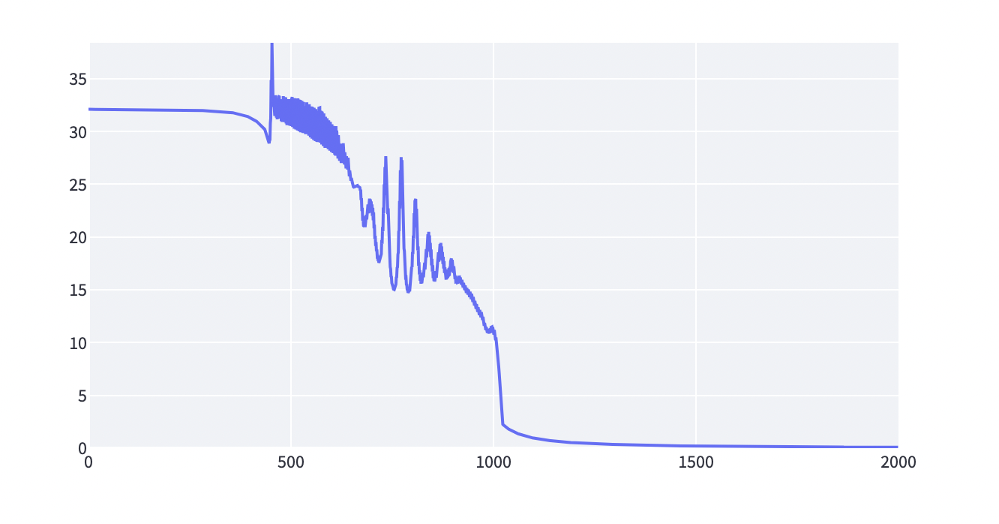
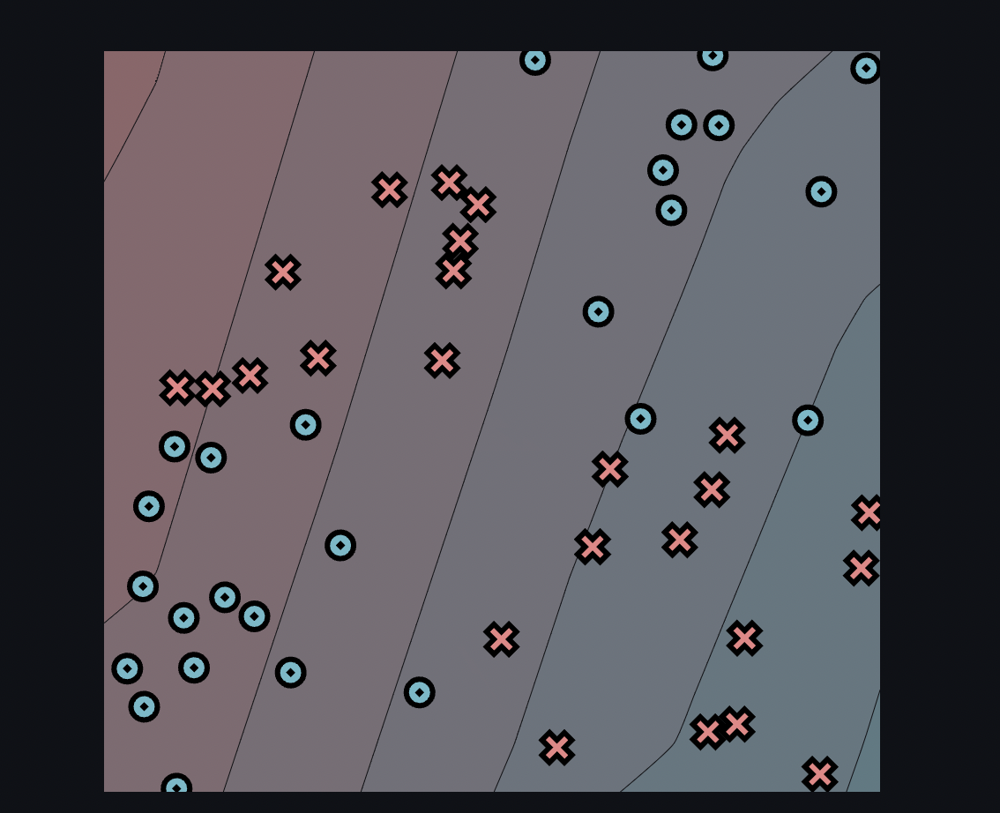
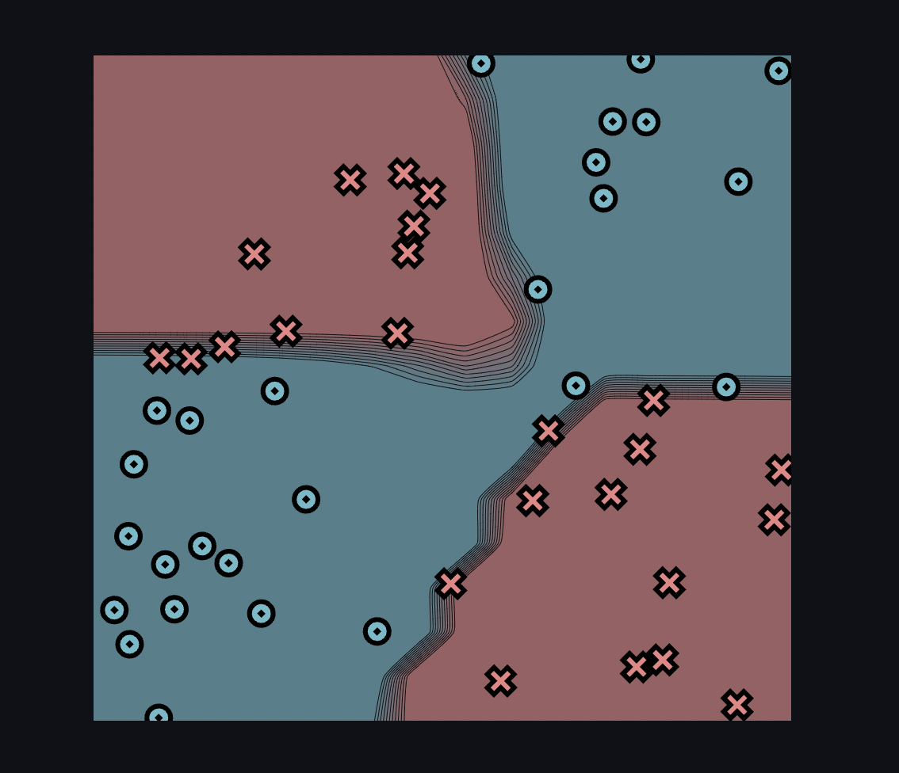
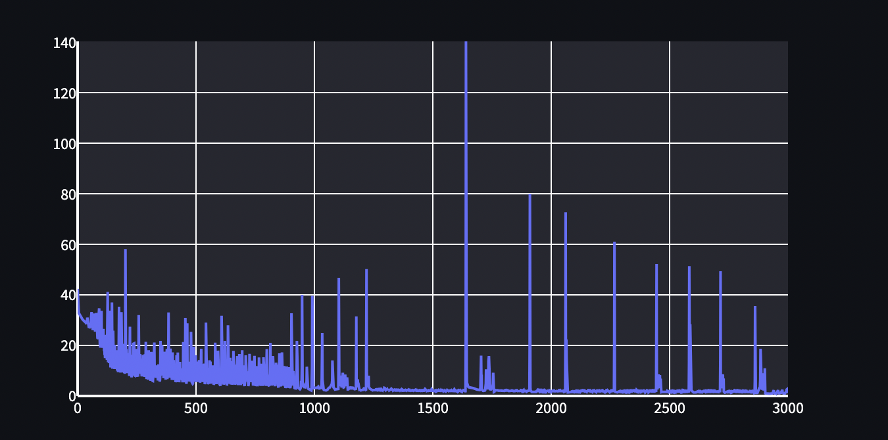

[](https://classroom.github.com/a/YFgwt0yY)
# MiniTorch Module 2


* Docs: https://minitorch.github.io/

* Overview: https://minitorch.github.io/module2/module2/

This assignment requires the following files from the previous assignments. You can get these by running

```bash
python sync_previous_module.py previous-module-dir current-module-dir
```

The files that will be synced are:

        minitorch/operators.py minitorch/module.py minitorch/autodiff.py minitorch/scalar.py minitorch/scalar_functions.py minitorch/module.py project/run_manual.py project/run_scalar.py project/datasets.py

# Task 2.5 Results

## Simple Data Set

### Parameters
- 50 points
- 2 hidden layers
- 0.1 Learning Rate
- 1000 epochs

### Initial Setting


### Trained Results


### Loss Function


### Logs

Time per epoch: 0.049s

```
Epoch: 10/1000, loss: 36.08883357160892, correct: 26
Epoch: 20/1000, loss: 35.23507040275149, correct: 26
Epoch: 30/1000, loss: 34.81482890727404, correct: 26
Epoch: 40/1000, loss: 34.573858583525315, correct: 26
Epoch: 50/1000, loss: 34.434436681325145, correct: 26
Epoch: 60/1000, loss: 34.35129888588819, correct: 26
Epoch: 70/1000, loss: 34.298813100164516, correct: 26
Epoch: 80/1000, loss: 34.2628441071759, correct: 26
Epoch: 90/1000, loss: 34.23519152958362, correct: 26
Epoch: 100/1000, loss: 34.21166403343843, correct: 26
Epoch: 110/1000, loss: 34.190336533950955, correct: 26
Epoch: 120/1000, loss: 34.16964781894762, correct: 26
Epoch: 130/1000, loss: 34.148794686384726, correct: 26
Epoch: 140/1000, loss: 34.1273984219812, correct: 26
Epoch: 150/1000, loss: 34.105162733977934, correct: 26
Epoch: 160/1000, loss: 34.0818662830296, correct: 26
Epoch: 170/1000, loss: 34.0573743327649, correct: 26
Epoch: 180/1000, loss: 34.03154553419217, correct: 26
Epoch: 190/1000, loss: 34.00433088193091, correct: 26
Epoch: 200/1000, loss: 33.975566546147434, correct: 26
Epoch: 210/1000, loss: 33.945154887384085, correct: 26
Epoch: 220/1000, loss: 33.912915576896914, correct: 26
Epoch: 230/1000, loss: 33.87882784010574, correct: 26
Epoch: 240/1000, loss: 33.842645498657426, correct: 26
Epoch: 250/1000, loss: 33.80427224841549, correct: 26
Epoch: 260/1000, loss: 33.76349987825598, correct: 26
Epoch: 270/1000, loss: 33.72020156345839, correct: 26
Epoch: 280/1000, loss: 33.6741810791906, correct: 26
Epoch: 290/1000, loss: 33.625201942596696, correct: 26
Epoch: 300/1000, loss: 33.57306968747329, correct: 26
Epoch: 310/1000, loss: 33.51753147856104, correct: 26
Epoch: 320/1000, loss: 33.45831581660316, correct: 26
Epoch: 330/1000, loss: 33.39513783942978, correct: 26
Epoch: 340/1000, loss: 33.32766957332252, correct: 26
Epoch: 350/1000, loss: 33.25555333835448, correct: 27
Epoch: 360/1000, loss: 33.17839808587355, correct: 31
Epoch: 370/1000, loss: 33.095775708407245, correct: 31
Epoch: 380/1000, loss: 33.00727515302363, correct: 34
Epoch: 390/1000, loss: 32.91264054375584, correct: 34
Epoch: 400/1000, loss: 32.811218900391125, correct: 36
Epoch: 410/1000, loss: 32.70246110156298, correct: 36
Epoch: 420/1000, loss: 32.585882080661854, correct: 36
Epoch: 430/1000, loss: 32.460777493207914, correct: 37
Epoch: 440/1000, loss: 32.3265222165813, correct: 38
Epoch: 450/1000, loss: 32.18386372202374, correct: 38
Epoch: 460/1000, loss: 32.033335455870244, correct: 39
Epoch: 470/1000, loss: 31.8737919726184, correct: 39
Epoch: 480/1000, loss: 31.70156786359677, correct: 39
Epoch: 490/1000, loss: 31.516956890515722, correct: 39
Epoch: 500/1000, loss: 31.319315780853263, correct: 40
Epoch: 510/1000, loss: 31.108026798395503, correct: 40
Epoch: 520/1000, loss: 30.880238346184846, correct: 40
Epoch: 530/1000, loss: 30.63736033825248, correct: 40
Epoch: 540/1000, loss: 30.37678631420686, correct: 40
Epoch: 550/1000, loss: 30.097304068659906, correct: 41
Epoch: 560/1000, loss: 29.80038073392042, correct: 41
Epoch: 570/1000, loss: 29.48237299086018, correct: 42
Epoch: 580/1000, loss: 29.143182940640106, correct: 42
Epoch: 590/1000, loss: 28.783109372854195, correct: 43
Epoch: 600/1000, loss: 28.402614279897627, correct: 43
Epoch: 610/1000, loss: 28.00011955058376, correct: 43
Epoch: 620/1000, loss: 27.575350399299282, correct: 43
Epoch: 630/1000, loss: 27.126921067300596, correct: 43
Epoch: 640/1000, loss: 26.656380606013485, correct: 43
Epoch: 650/1000, loss: 26.16219980747625, correct: 43
Epoch: 660/1000, loss: 25.644866656544114, correct: 43
Epoch: 670/1000, loss: 25.11181721101126, correct: 43
Epoch: 680/1000, loss: 24.562814708708558, correct: 44
Epoch: 690/1000, loss: 24.001732594768534, correct: 44
Epoch: 700/1000, loss: 23.424575916256867, correct: 44
Epoch: 710/1000, loss: 22.843138972205683, correct: 44
Epoch: 720/1000, loss: 22.246239537471887, correct: 44
Epoch: 730/1000, loss: 21.643235042287557, correct: 44
Epoch: 740/1000, loss: 21.03926089042005, correct: 45
Epoch: 750/1000, loss: 20.442138159247435, correct: 44
Epoch: 760/1000, loss: 19.853584379485763, correct: 45
Epoch: 770/1000, loss: 19.27617103812969, correct: 45
Epoch: 780/1000, loss: 18.706421078997753, correct: 45
Epoch: 790/1000, loss: 18.150227196344144, correct: 45
Epoch: 800/1000, loss: 17.598462071088942, correct: 46
Epoch: 810/1000, loss: 17.056257901850728, correct: 47
Epoch: 820/1000, loss: 16.52194754360948, correct: 47
Epoch: 830/1000, loss: 15.998867863717845, correct: 48
Epoch: 840/1000, loss: 15.487759648671108, correct: 49
Epoch: 850/1000, loss: 14.98853750702091, correct: 49
Epoch: 860/1000, loss: 14.502031513870598, correct: 49
Epoch: 870/1000, loss: 14.026988582983927, correct: 49
Epoch: 880/1000, loss: 13.57253920935301, correct: 49
Epoch: 890/1000, loss: 13.138282324561, correct: 49
Epoch: 900/1000, loss: 12.720721972899888, correct: 49
Epoch: 910/1000, loss: 12.323502492783502, correct: 50
Epoch: 920/1000, loss: 11.94080405554002, correct: 50
Epoch: 930/1000, loss: 11.571738745435386, correct: 50
Epoch: 940/1000, loss: 11.214530652125353, correct: 50
Epoch: 950/1000, loss: 10.871772336794372, correct: 50
Epoch: 960/1000, loss: 10.544601257913943, correct: 50
Epoch: 970/1000, loss: 10.234632708654154, correct: 50
Epoch: 980/1000, loss: 9.935599332012897, correct: 50
Epoch: 990/1000, loss: 9.64916451404238, correct: 50
Epoch: 1000/1000, loss: 9.373797046255262, correct: 50
```

## Diag Data Set

### Parameters
- 50 points
- 2 hidden layers
- 0.5 Learning Rate
- 2000 epochs

### Initial Setting


### Trained Results


### Loss Function


### Logs

Time per epoch: 0.047s

```
Epoch: 0/2000, loss: 0, correct: 0
Epoch: 10/2000, loss: 19.48726365957854, correct: 45
Epoch: 20/2000, loss: 16.348106039110398, correct: 45
Epoch: 30/2000, loss: 15.974817408114255, correct: 45
Epoch: 40/2000, loss: 15.895096883189037, correct: 45
Epoch: 50/2000, loss: 15.853213771792026, correct: 45
Epoch: 60/2000, loss: 15.813720197675249, correct: 45
Epoch: 70/2000, loss: 15.7708827937184, correct: 45
Epoch: 80/2000, loss: 15.723295522930353, correct: 45
Epoch: 90/2000, loss: 15.670114387752898, correct: 45
Epoch: 100/2000, loss: 15.610469196992527, correct: 45
Epoch: 110/2000, loss: 15.543329823442527, correct: 45
Epoch: 120/2000, loss: 15.467497474435794, correct: 45
Epoch: 130/2000, loss: 15.38154683630707, correct: 45
Epoch: 140/2000, loss: 15.283791241941447, correct: 45
Epoch: 150/2000, loss: 15.17221025925512, correct: 45
Epoch: 160/2000, loss: 15.044393740617627, correct: 45
Epoch: 170/2000, loss: 14.898600235160524, correct: 45
Epoch: 180/2000, loss: 14.73153804283898, correct: 45
Epoch: 190/2000, loss: 14.539865058688983, correct: 45
Epoch: 200/2000, loss: 14.31844457049775, correct: 45
Epoch: 210/2000, loss: 14.068948271399776, correct: 45
Epoch: 220/2000, loss: 13.787439013234083, correct: 45
Epoch: 230/2000, loss: 13.470851550504884, correct: 45
Epoch: 240/2000, loss: 13.117999337857032, correct: 45
Epoch: 250/2000, loss: 12.716198677022039, correct: 45
Epoch: 260/2000, loss: 12.26814195422128, correct: 45
Epoch: 270/2000, loss: 11.777806855839192, correct: 45
Epoch: 280/2000, loss: 11.244341433084587, correct: 45
Epoch: 290/2000, loss: 10.683309616032606, correct: 45
Epoch: 300/2000, loss: 10.091287671902355, correct: 45
Epoch: 310/2000, loss: 9.466875379795077, correct: 45
Epoch: 320/2000, loss: 8.852157183295027, correct: 45
Epoch: 330/2000, loss: 8.25337031428833, correct: 45
Epoch: 340/2000, loss: 7.710277415989268, correct: 45
Epoch: 350/2000, loss: 7.33284739695798, correct: 45
Epoch: 360/2000, loss: 6.900785039347391, correct: 45
Epoch: 370/2000, loss: 6.561485621992055, correct: 48
Epoch: 380/2000, loss: 6.294644278191456, correct: 48
Epoch: 390/2000, loss: 6.067499321712338, correct: 48
Epoch: 400/2000, loss: 5.757279325591353, correct: 48
Epoch: 410/2000, loss: 5.542199987401281, correct: 48
Epoch: 420/2000, loss: 5.331379181464956, correct: 48
Epoch: 430/2000, loss: 5.138932735326348, correct: 48
Epoch: 440/2000, loss: 4.965962102396593, correct: 48
Epoch: 450/2000, loss: 4.80968747414394, correct: 48
Epoch: 460/2000, loss: 4.665568697692098, correct: 48
Epoch: 470/2000, loss: 4.533427543461048, correct: 48
Epoch: 480/2000, loss: 4.411389561619382, correct: 48
Epoch: 490/2000, loss: 4.298235243973663, correct: 48
Epoch: 500/2000, loss: 4.192931218911906, correct: 48
Epoch: 510/2000, loss: 4.094597992436209, correct: 48
Epoch: 520/2000, loss: 4.002477417052319, correct: 49
Epoch: 530/2000, loss: 3.9159164660643766, correct: 49
Epoch: 540/2000, loss: 3.8343525742954703, correct: 49
Epoch: 550/2000, loss: 3.757297617023263, correct: 49
Epoch: 560/2000, loss: 3.6843263619058524, correct: 49
Epoch: 570/2000, loss: 3.615066883644913, correct: 49
Epoch: 580/2000, loss: 3.549192591887214, correct: 49
Epoch: 590/2000, loss: 3.4864163694857644, correct: 49
Epoch: 600/2000, loss: 3.426483599728722, correct: 49
Epoch: 610/2000, loss: 3.3691669943050595, correct: 49
Epoch: 620/2000, loss: 3.314264359307959, correct: 49
Epoch: 630/2000, loss: 3.2615952565433908, correct: 49
Epoch: 640/2000, loss: 3.2109976687025017, correct: 49
Epoch: 650/2000, loss: 3.162325621218647, correct: 49
Epoch: 660/2000, loss: 3.1154471571365745, correct: 49
Epoch: 670/2000, loss: 3.07024260774637, correct: 49
Epoch: 680/2000, loss: 3.026603111793159, correct: 49
Epoch: 690/2000, loss: 2.9844293442212573, correct: 49
Epoch: 700/2000, loss: 2.9436304220385825, correct: 49
Epoch: 710/2000, loss: 2.9041229602957253, correct: 49
Epoch: 720/2000, loss: 2.8658302556043225, correct: 49
Epoch: 730/2000, loss: 2.8286815782622963, correct: 49
Epoch: 740/2000, loss: 2.792611557060734, correct: 49
Epoch: 750/2000, loss: 2.75755964333892, correct: 49
Epoch: 760/2000, loss: 2.72346964292665, correct: 49
Epoch: 770/2000, loss: 2.690289306342864, correct: 49
Epoch: 780/2000, loss: 2.6579699690683984, correct: 49
Epoch: 790/2000, loss: 2.626466234927822, correct: 49
Epoch: 800/2000, loss: 2.595735696640614, correct: 49
Epoch: 810/2000, loss: 2.565738688468111, correct: 49
Epoch: 820/2000, loss: 2.5364380666159785, correct: 49
Epoch: 830/2000, loss: 2.507799013674166, correct: 49
Epoch: 840/2000, loss: 2.4797888639053642, correct: 49
Epoch: 850/2000, loss: 2.4523769466435046, correct: 49
Epoch: 860/2000, loss: 2.4255344454483154, correct: 49
Epoch: 870/2000, loss: 2.399234270990334, correct: 49
Epoch: 880/2000, loss: 2.373450945921926, correct: 49
Epoch: 890/2000, loss: 2.348160565970422, correct: 49
Epoch: 900/2000, loss: 2.3233405705758083, correct: 49
Epoch: 910/2000, loss: 2.2989696285836385, correct: 49
Epoch: 920/2000, loss: 2.2750277567083432, correct: 49
Epoch: 930/2000, loss: 2.251496140871856, correct: 49
Epoch: 940/2000, loss: 2.2283570678430933, correct: 49
Epoch: 950/2000, loss: 2.2055938617813737, correct: 49
Epoch: 960/2000, loss: 2.183190834955876, correct: 49
Epoch: 970/2000, loss: 2.1611332190217936, correct: 49
Epoch: 980/2000, loss: 2.1394070892613484, correct: 49
Epoch: 990/2000, loss: 2.1179993664641774, correct: 49
Epoch: 1000/2000, loss: 2.0968977485043805, correct: 49
Epoch: 1010/2000, loss: 2.076090667268878, correct: 49
Epoch: 1020/2000, loss: 2.0555672479543157, correct: 49
Epoch: 1030/2000, loss: 2.035317270539054, correct: 49
Epoch: 1040/2000, loss: 2.0153311332627903, correct: 49
Epoch: 1050/2000, loss: 1.995599817968736, correct: 49
Epoch: 1060/2000, loss: 1.9761148571823108, correct: 49
Epoch: 1070/2000, loss: 1.9568683028166831, correct: 50
Epoch: 1080/2000, loss: 1.93785269640923, correct: 50
Epoch: 1090/2000, loss: 1.9190610408046818, correct: 50
Epoch: 1100/2000, loss: 1.9004867732105288, correct: 50
Epoch: 1110/2000, loss: 1.882123739558415, correct: 50
Epoch: 1120/2000, loss: 1.8639661822893419, correct: 50
Epoch: 1130/2000, loss: 1.8460086844926322, correct: 50
Epoch: 1140/2000, loss: 1.8282461684388942, correct: 50
Epoch: 1150/2000, loss: 1.8106738835151928, correct: 50
Epoch: 1160/2000, loss: 1.7932873771979085, correct: 50
Epoch: 1170/2000, loss: 1.7760824761801615, correct: 50
Epoch: 1180/2000, loss: 1.7590552684728782, correct: 50
Epoch: 1190/2000, loss: 1.742202086442672, correct: 50
Epoch: 1200/2000, loss: 1.7255194907508418, correct: 50
Epoch: 1210/2000, loss: 1.709004255158702, correct: 50
Epoch: 1220/2000, loss: 1.6926533521652078, correct: 50
Epoch: 1230/2000, loss: 1.6764639394434475, correct: 50
Epoch: 1240/2000, loss: 1.6604333470431532, correct: 50
Epoch: 1250/2000, loss: 1.6445590653269062, correct: 50
Epoch: 1260/2000, loss: 1.6288387336082115, correct: 50
Epoch: 1270/2000, loss: 1.6132701294601903, correct: 50
Epoch: 1280/2000, loss: 1.5978511586641857, correct: 50
Epoch: 1290/2000, loss: 1.5825798457681854, correct: 50
Epoch: 1300/2000, loss: 1.5674543252256687, correct: 50
Epoch: 1310/2000, loss: 1.5524728330861342, correct: 50
Epoch: 1320/2000, loss: 1.5376336992093913, correct: 50
Epoch: 1330/2000, loss: 1.5229353399764975, correct: 50
Epoch: 1340/2000, loss: 1.508376251471043, correct: 50
Epoch: 1350/2000, loss: 1.493955003105441, correct: 50
Epoch: 1360/2000, loss: 1.4796702316677492, correct: 50
Epoch: 1370/2000, loss: 1.4655206357655663, correct: 50
Epoch: 1380/2000, loss: 1.4515049706444183, correct: 50
Epoch: 1390/2000, loss: 1.4376220433591338, correct: 50
Epoch: 1400/2000, loss: 1.4238707082775746, correct: 50
Epoch: 1410/2000, loss: 1.4102498628971651, correct: 50
Epoch: 1420/2000, loss: 1.396758443955508, correct: 50
Epoch: 1430/2000, loss: 1.3833954238174135, correct: 50
Epoch: 1440/2000, loss: 1.3701598071215353, correct: 50
Epoch: 1450/2000, loss: 1.3570506276707264, correct: 50
Epoch: 1460/2000, loss: 1.3440669455510603, correct: 50
Epoch: 1470/2000, loss: 1.331207844465342, correct: 50
Epoch: 1480/2000, loss: 1.3184724292677048, correct: 50
Epoch: 1490/2000, loss: 1.3058598236866574, correct: 50
Epoch: 1500/2000, loss: 1.293369168224712, correct: 50
Epoch: 1510/2000, loss: 1.2809996182233485, correct: 50
Epoch: 1520/2000, loss: 1.2687503420828288, correct: 50
Epoch: 1530/2000, loss: 1.256620519626909, correct: 50
Epoch: 1540/2000, loss: 1.244609340603158, correct: 50
Epoch: 1550/2000, loss: 1.232716003310109, correct: 50
Epoch: 1560/2000, loss: 1.2209397133430109, correct: 50
Epoch: 1570/2000, loss: 1.2092796824504646, correct: 50
Epoch: 1580/2000, loss: 1.1977351274946388, correct: 50
Epoch: 1590/2000, loss: 1.1863052695082816, correct: 50
Epoch: 1600/2000, loss: 1.1749893328420602, correct: 50
Epoch: 1610/2000, loss: 1.1637865443962399, correct: 50
Epoch: 1620/2000, loss: 1.152696132931021, correct: 50
Epoch: 1630/2000, loss: 1.1417173284501965, correct: 50
Epoch: 1640/2000, loss: 1.1308493616531323, correct: 50
Epoch: 1650/2000, loss: 1.1200914634503878, correct: 50
Epoch: 1660/2000, loss: 1.109442864538503, correct: 50
Epoch: 1670/2000, loss: 1.0989027950298438, correct: 50
Epoch: 1680/2000, loss: 1.0884704841335697, correct: 50
Epoch: 1690/2000, loss: 1.0781451598840466, correct: 50
Epoch: 1700/2000, loss: 1.067926048913264, correct: 50
Epoch: 1710/2000, loss: 1.0578123762639915, correct: 50
Epoch: 1720/2000, loss: 1.047803365240617, correct: 50
Epoch: 1730/2000, loss: 1.0378982372948151, correct: 50
Epoch: 1740/2000, loss: 1.0280962119433141, correct: 50
Epoch: 1750/2000, loss: 1.0183965067152352, correct: 50
Epoch: 1760/2000, loss: 1.0087983371266298, correct: 50
Epoch: 1770/2000, loss: 0.9993009166799409, correct: 50
Epoch: 1780/2000, loss: 0.9899034568863179, correct: 50
Epoch: 1790/2000, loss: 0.9806051673087505, correct: 50
Epoch: 1800/2000, loss: 0.9714052556242324, correct: 50
Epoch: 1810/2000, loss: 0.9623029277031352, correct: 50
Epoch: 1820/2000, loss: 0.953297387704203, correct: 50
Epoch: 1830/2000, loss: 0.9443878381836098, correct: 50
Epoch: 1840/2000, loss: 0.935573480216635, correct: 50
Epoch: 1850/2000, loss: 0.9268535135306178, correct: 50
Epoch: 1860/2000, loss: 0.9182271366479, correct: 50
Epoch: 1870/2000, loss: 0.9096935470375935, correct: 50
Epoch: 1880/2000, loss: 0.9012519412750521, correct: 50
Epoch: 1890/2000, loss: 0.8929015152080102, correct: 50
Epoch: 1900/2000, loss: 0.8846414641284083, correct: 50
Epoch: 1910/2000, loss: 0.8764709829490257, correct: 50
Epoch: 1920/2000, loss: 0.8683892663840438, correct: 50
Epoch: 1930/2000, loss: 0.8603955091327723, correct: 50
Epoch: 1940/2000, loss: 0.8524889060658024, correct: 50
Epoch: 1950/2000, loss: 0.8446686524129008, correct: 50
Epoch: 1960/2000, loss: 0.8369339439520109, correct: 50
Epoch: 1970/2000, loss: 0.8292839771987929, correct: 50
Epoch: 1980/2000, loss: 0.8217179495961243, correct: 50
Epoch: 1990/2000, loss: 0.8142350597030998, correct: 50
Epoch: 2000/2000, loss: 0.8068345073830323, correct: 50
```

## Split Data Set

### Parameters
- 50 points
- 6 hidden layers
- 5.0 Learning Rate
- 2000 epochs

### Initial Setting


### Trained Results


### Loss Function




### Logs

Time Per Epoch: 0.163s.

```
Epoch: 0/2000, loss: 0, correct: 0
Epoch: 10/2000, loss: 32.0908404666406, correct: 33
Epoch: 20/2000, loss: 32.08609316020129, correct: 33
Epoch: 30/2000, loss: 32.0819161111269, correct: 33
Epoch: 40/2000, loss: 32.07820366950463, correct: 33
Epoch: 50/2000, loss: 32.07486886186053, correct: 33
Epoch: 60/2000, loss: 32.07183903375255, correct: 33
Epoch: 70/2000, loss: 32.069052505957444, correct: 33
Epoch: 80/2000, loss: 32.06645596393006, correct: 33
Epoch: 90/2000, loss: 32.064002378875735, correct: 33
Epoch: 100/2000, loss: 32.0616493123806, correct: 33
Epoch: 110/2000, loss: 32.05935749316181, correct: 33
Epoch: 120/2000, loss: 32.05708957931382, correct: 33
Epoch: 130/2000, loss: 32.054809035763874, correct: 33
Epoch: 140/2000, loss: 32.05247906661798, correct: 33
Epoch: 150/2000, loss: 32.05006154692756, correct: 33
Epoch: 160/2000, loss: 32.047515898766854, correct: 33
Epoch: 170/2000, loss: 32.04479785247956, correct: 33
Epoch: 180/2000, loss: 32.04185802514887, correct: 33
Epoch: 190/2000, loss: 32.03864023383516, correct: 33
Epoch: 200/2000, loss: 32.03507943931981, correct: 33
Epoch: 210/2000, loss: 32.03109918450133, correct: 33
Epoch: 220/2000, loss: 32.02660834644915, correct: 33
Epoch: 230/2000, loss: 32.02149695681672, correct: 33
Epoch: 240/2000, loss: 32.01577401515836, correct: 33
Epoch: 250/2000, loss: 32.00916956569985, correct: 33
Epoch: 260/2000, loss: 32.00149016697266, correct: 33
Epoch: 270/2000, loss: 31.992491998975236, correct: 33
Epoch: 280/2000, loss: 31.981866762383344, correct: 33
Epoch: 290/2000, loss: 31.969219336026057, correct: 33
Epoch: 300/2000, loss: 31.954036771211097, correct: 33
Epoch: 310/2000, loss: 31.93564709842267, correct: 33
Epoch: 320/2000, loss: 31.913681417073335, correct: 33
Epoch: 330/2000, loss: 31.885971601486002, correct: 33
Epoch: 340/2000, loss: 31.85213627165397, correct: 33
Epoch: 350/2000, loss: 31.809555612982813, correct: 33
Epoch: 360/2000, loss: 31.755328410221, correct: 33
Epoch: 370/2000, loss: 31.68537758629166, correct: 33
Epoch: 380/2000, loss: 31.594130364208866, correct: 33
Epoch: 390/2000, loss: 31.475526579233666, correct: 33
Epoch: 400/2000, loss: 31.31953935579206, correct: 33
Epoch: 410/2000, loss: 31.10610440998039, correct: 33
Epoch: 420/2000, loss: 30.878632771484078, correct: 33
Epoch: 430/2000, loss: 30.477010071261443, correct: 33
Epoch: 440/2000, loss: 29.718327893064288, correct: 33
Epoch: 450/2000, loss: 30.779756520021778, correct: 33
Epoch: 460/2000, loss: 33.13083837079319, correct: 33
Epoch: 470/2000, loss: 33.29943438555225, correct: 33
Epoch: 480/2000, loss: 32.95495332028757, correct: 33
Epoch: 490/2000, loss: 32.765328201830606, correct: 33
Epoch: 500/2000, loss: 32.95134893994129, correct: 33
Epoch: 510/2000, loss: 33.15630587215068, correct: 33
Epoch: 520/2000, loss: 33.1423563353546, correct: 33
Epoch: 530/2000, loss: 32.48173953066917, correct: 33
Epoch: 540/2000, loss: 32.773274054766915, correct: 33
Epoch: 550/2000, loss: 32.15659285548021, correct: 33
Epoch: 560/2000, loss: 31.912910594510727, correct: 33
Epoch: 570/2000, loss: 32.220779038066134, correct: 33
Epoch: 580/2000, loss: 31.792746206925905, correct: 33
Epoch: 590/2000, loss: 31.24701798510917, correct: 33
Epoch: 600/2000, loss: 30.78633113552555, correct: 33
Epoch: 610/2000, loss: 30.322429576719962, correct: 33
Epoch: 620/2000, loss: 29.13810513785628, correct: 33
Epoch: 630/2000, loss: 28.88650401607219, correct: 34
Epoch: 640/2000, loss: 27.577129955232955, correct: 36
Epoch: 650/2000, loss: 25.583845204619337, correct: 38
Epoch: 660/2000, loss: 24.741380194106046, correct: 39
Epoch: 670/2000, loss: 24.646378429807495, correct: 39
Epoch: 680/2000, loss: 21.08186117211937, correct: 40
Epoch: 690/2000, loss: 22.00933305165923, correct: 40
Epoch: 700/2000, loss: 22.277058074693862, correct: 40
Epoch: 710/2000, loss: 19.159836688023475, correct: 40
Epoch: 720/2000, loss: 17.607620496949075, correct: 43
Epoch: 730/2000, loss: 22.258545058618584, correct: 40
Epoch: 740/2000, loss: 22.175479420300046, correct: 40
Epoch: 750/2000, loss: 15.635515881166388, correct: 45
Epoch: 760/2000, loss: 15.521031445933174, correct: 45
Epoch: 770/2000, loss: 22.703746798905197, correct: 40
Epoch: 780/2000, loss: 18.91609679556404, correct: 41
Epoch: 790/2000, loss: 14.723534613889614, correct: 45
Epoch: 800/2000, loss: 17.139081611320595, correct: 42
Epoch: 810/2000, loss: 21.038106420486688, correct: 40
Epoch: 820/2000, loss: 15.859926740261251, correct: 44
Epoch: 830/2000, loss: 16.547260096240482, correct: 42
Epoch: 840/2000, loss: 19.13496784807733, correct: 40
Epoch: 850/2000, loss: 16.72955127095597, correct: 42
Epoch: 860/2000, loss: 16.155886486156632, correct: 42
Epoch: 870/2000, loss: 18.260983194060206, correct: 40
Epoch: 880/2000, loss: 16.590426969749032, correct: 42
Epoch: 890/2000, loss: 16.26450191399411, correct: 42
Epoch: 900/2000, loss: 16.758945329872475, correct: 41
Epoch: 910/2000, loss: 15.774740926770866, correct: 42
Epoch: 920/2000, loss: 15.604440690831812, correct: 41
Epoch: 930/2000, loss: 14.980064395529283, correct: 42
Epoch: 940/2000, loss: 14.464932883070498, correct: 42
Epoch: 950/2000, loss: 13.853738194229205, correct: 42
Epoch: 960/2000, loss: 13.049743694722615, correct: 42
Epoch: 970/2000, loss: 12.38848887965979, correct: 42
Epoch: 980/2000, loss: 11.368643630196626, correct: 42
Epoch: 990/2000, loss: 10.864527786935295, correct: 43
Epoch: 1000/2000, loss: 10.892942328265132, correct: 43
Epoch: 1010/2000, loss: 9.292659133762571, correct: 44
Epoch: 1020/2000, loss: 3.2991207751916676, correct: 49
Epoch: 1030/2000, loss: 2.0390595789495864, correct: 50
Epoch: 1040/2000, loss: 1.7719007932349733, correct: 50
Epoch: 1050/2000, loss: 1.5622148218594936, correct: 50
Epoch: 1060/2000, loss: 1.3937122454885766, correct: 50
Epoch: 1070/2000, loss: 1.2553485482793096, correct: 50
Epoch: 1080/2000, loss: 1.1399278847951484, correct: 50
Epoch: 1090/2000, loss: 1.0423141471018278, correct: 50
Epoch: 1100/2000, loss: 0.9588061527515862, correct: 50
Epoch: 1110/2000, loss: 0.8866514964560622, correct: 50
Epoch: 1120/2000, loss: 0.8237690838615863, correct: 50
Epoch: 1130/2000, loss: 0.7685301792690157, correct: 50
Epoch: 1140/2000, loss: 0.7196807807716548, correct: 50
Epoch: 1150/2000, loss: 0.6762063702881567, correct: 50
Epoch: 1160/2000, loss: 0.6372891583337811, correct: 50
Epoch: 1170/2000, loss: 0.6022727318063092, correct: 50
Epoch: 1180/2000, loss: 0.5706165272516649, correct: 50
Epoch: 1190/2000, loss: 0.5418744245582701, correct: 50
Epoch: 1200/2000, loss: 0.5156745569565373, correct: 50
Epoch: 1210/2000, loss: 0.491705257646282, correct: 50
Epoch: 1220/2000, loss: 0.46970042283963237, correct: 50
Epoch: 1230/2000, loss: 0.44943522444734385, correct: 50
Epoch: 1240/2000, loss: 0.4307172745358329, correct: 50
Epoch: 1250/2000, loss: 0.4133810676972618, correct: 50
Epoch: 1260/2000, loss: 0.39728347863409874, correct: 50
Epoch: 1270/2000, loss: 0.38230016075587536, correct: 50
Epoch: 1280/2000, loss: 0.3683226015179351, correct: 50
Epoch: 1290/2000, loss: 0.35525569564558, correct: 50
Epoch: 1300/2000, loss: 0.3430157780509344, correct: 50
Epoch: 1310/2000, loss: 0.3315289555715597, correct: 50
Epoch: 1320/2000, loss: 0.32072975147581806, correct: 50
Epoch: 1330/2000, loss: 0.3105599400428207, correct: 50
Epoch: 1340/2000, loss: 0.3009675909543709, correct: 50
Epoch: 1350/2000, loss: 0.29190790536799127, correct: 50
Epoch: 1360/2000, loss: 0.2834067404841293, correct: 50
Epoch: 1370/2000, loss: 0.27540742086287895, correct: 50
Epoch: 1380/2000, loss: 0.2678134298548594, correct: 50
Epoch: 1390/2000, loss: 0.26059377946596646, correct: 50
Epoch: 1400/2000, loss: 0.25372228138373903, correct: 50
Epoch: 1410/2000, loss: 0.24717509819702824, correct: 50
Epoch: 1420/2000, loss: 0.2409304863436643, correct: 50
Epoch: 1430/2000, loss: 0.2349685732658844, correct: 50
Epoch: 1440/2000, loss: 0.2292711622685997, correct: 50
Epoch: 1450/2000, loss: 0.22382156115871887, correct: 50
Epoch: 1460/2000, loss: 0.2186044313645823, correct: 50
Epoch: 1470/2000, loss: 0.2136056547466165, correct: 50
Epoch: 1480/2000, loss: 0.20881221573503222, correct: 50
Epoch: 1490/2000, loss: 0.2042120967837824, correct: 50
Epoch: 1500/2000, loss: 0.19979418542512503, correct: 50
Epoch: 1510/2000, loss: 0.19554819145651037, correct: 50
Epoch: 1520/2000, loss: 0.19146457299956596, correct: 50
Epoch: 1530/2000, loss: 0.18753447034638826, correct: 50
Epoch: 1540/2000, loss: 0.18374964665698829, correct: 50
Epoch: 1550/2000, loss: 0.18010243469771706, correct: 50
Epoch: 1560/2000, loss: 0.17658568891787874, correct: 50
Epoch: 1570/2000, loss: 0.17319274225340733, correct: 50
Epoch: 1580/2000, loss: 0.1699173671248059, correct: 50
Epoch: 1590/2000, loss: 0.16675374016397682, correct: 50
Epoch: 1600/2000, loss: 0.16369641026241022, correct: 50
Epoch: 1610/2000, loss: 0.16074026958320245, correct: 50
Epoch: 1620/2000, loss: 0.15788052722246143, correct: 50
Epoch: 1630/2000, loss: 0.15511273761362623, correct: 50
Epoch: 1640/2000, loss: 0.15243271416160598, correct: 50
Epoch: 1650/2000, loss: 0.14983637245116171, correct: 50
Epoch: 1660/2000, loss: 0.14731997146348233, correct: 50
Epoch: 1670/2000, loss: 0.14488223776364498, correct: 50
Epoch: 1680/2000, loss: 0.14251740539842137, correct: 50
Epoch: 1690/2000, loss: 0.1402249333185293, correct: 50
Epoch: 1700/2000, loss: 0.13800108694185562, correct: 50
Epoch: 1710/2000, loss: 0.13583214736242488, correct: 50
Epoch: 1720/2000, loss: 0.13373120562686777, correct: 50
Epoch: 1730/2000, loss: 0.131689419084274, correct: 50
Epoch: 1740/2000, loss: 0.12970436570404828, correct: 50
Epoch: 1750/2000, loss: 0.1277737687094412, correct: 50
Epoch: 1760/2000, loss: 0.1258954715151363, correct: 50
Epoch: 1770/2000, loss: 0.12406742920297635, correct: 50
Epoch: 1780/2000, loss: 0.1222877012777244, correct: 50
Epoch: 1790/2000, loss: 0.12055444506552701, correct: 50
Epoch: 1800/2000, loss: 0.11886590962246026, correct: 50
Epoch: 1810/2000, loss: 0.11722043009714, correct: 50
Epoch: 1820/2000, loss: 0.11561642250645263, correct: 50
Epoch: 1830/2000, loss: 0.1140523788889972, correct: 50
Epoch: 1840/2000, loss: 0.11252525840731874, correct: 50
Epoch: 1850/2000, loss: 0.11103572249570964, correct: 50
Epoch: 1860/2000, loss: 0.10958356162564674, correct: 50
Epoch: 1870/2000, loss: 0.10816163035960225, correct: 50
Epoch: 1880/2000, loss: 0.10677905778924891, correct: 50
Epoch: 1890/2000, loss: 0.10542821785077489, correct: 50
Epoch: 1900/2000, loss: 0.1041036470175589, correct: 50
Epoch: 1910/2000, loss: 0.10281290862857194, correct: 50
Epoch: 1920/2000, loss: 0.10155435115762498, correct: 50
Epoch: 1930/2000, loss: 0.10031809765887587, correct: 50
Epoch: 1940/2000, loss: 0.09911128622965784, correct: 50
Epoch: 1950/2000, loss: 0.09793162640582895, correct: 50
Epoch: 1960/2000, loss: 0.09677744376299399, correct: 50
Epoch: 1970/2000, loss: 0.09564737873857915, correct: 50
Epoch: 1980/2000, loss: 0.09454211692831004, correct: 50
Epoch: 1990/2000, loss: 0.0934601878543782, correct: 50
Epoch: 2000/2000, loss: 0.09240087489918829, correct: 50
```

## Xor Data Set

### Parameters
- 50 points
- 6 hidden layers
- 1.0 Learning Rate
- 3000 epochs

### Initial Setting



### Trained Results



### Loss Function




### Logs

Time Per Epoch: 0.143s.

```
Epoch: 10/3000, loss: 32.044063282079684, correct: 36
Epoch: 20/3000, loss: 30.536481860330333, correct: 36
Epoch: 30/3000, loss: 29.26779557297803, correct: 36
Epoch: 40/3000, loss: 29.71550202235644, correct: 32
Epoch: 50/3000, loss: 27.156941528320264, correct: 36
Epoch: 60/3000, loss: 33.20165801844693, correct: 25
Epoch: 70/3000, loss: 32.65224908009082, correct: 27
Epoch: 80/3000, loss: 32.85047167993136, correct: 30
Epoch: 90/3000, loss: 31.93039918207933, correct: 31
Epoch: 100/3000, loss: 26.557982558057333, correct: 37
Epoch: 110/3000, loss: 26.584877236186212, correct: 38
Epoch: 120/3000, loss: 21.517413848426187, correct: 41
Epoch: 130/3000, loss: 13.398560911945822, correct: 47
Epoch: 140/3000, loss: 11.290347432455059, correct: 45
Epoch: 150/3000, loss: 15.451952157815045, correct: 42
Epoch: 160/3000, loss: 13.20925848458851, correct: 44
Epoch: 170/3000, loss: 10.0310493901433, correct: 46
Epoch: 180/3000, loss: 9.749070669268903, correct: 48
Epoch: 190/3000, loss: 13.499975123469126, correct: 43
Epoch: 200/3000, loss: 8.76408296997892, correct: 47
Epoch: 210/3000, loss: 9.086984627314571, correct: 47
Epoch: 220/3000, loss: 9.085070866419395, correct: 47
Epoch: 230/3000, loss: 9.671101771121636, correct: 46
Epoch: 240/3000, loss: 20.81651749059813, correct: 42
Epoch: 250/3000, loss: 7.607023965781888, correct: 47
Epoch: 260/3000, loss: 11.056411616979512, correct: 45
Epoch: 270/3000, loss: 8.357749497551278, correct: 46
Epoch: 280/3000, loss: 8.077019042231056, correct: 46
Epoch: 290/3000, loss: 10.479329304199705, correct: 45
Epoch: 300/3000, loss: 9.565233294664166, correct: 45
Epoch: 310/3000, loss: 6.3797481476979385, correct: 48
Epoch: 320/3000, loss: 7.335191073691007, correct: 47
Epoch: 330/3000, loss: 8.485250637824876, correct: 46
Epoch: 340/3000, loss: 6.128516462928379, correct: 48
Epoch: 350/3000, loss: 8.844769619833977, correct: 46
Epoch: 360/3000, loss: 8.263966975229023, correct: 47
Epoch: 370/3000, loss: 12.220464190590496, correct: 45
Epoch: 380/3000, loss: 6.994005310687339, correct: 47
Epoch: 390/3000, loss: 7.446565507608591, correct: 46
Epoch: 400/3000, loss: 8.340214517874667, correct: 47
Epoch: 410/3000, loss: 7.714297435670234, correct: 47
Epoch: 420/3000, loss: 5.7265060202876485, correct: 48
Epoch: 430/3000, loss: 5.438067142924282, correct: 48
Epoch: 440/3000, loss: 6.674762702254126, correct: 48
Epoch: 450/3000, loss: 5.838741284920118, correct: 48
Epoch: 460/3000, loss: 4.817106264938891, correct: 49
Epoch: 470/3000, loss: 5.758607416199598, correct: 48
Epoch: 480/3000, loss: 25.40678010336637, correct: 41
Epoch: 490/3000, loss: 8.58424486610001, correct: 47
Epoch: 500/3000, loss: 9.44833193867514, correct: 46
Epoch: 510/3000, loss: 6.122441255273493, correct: 47
Epoch: 520/3000, loss: 6.172274246390663, correct: 47
Epoch: 530/3000, loss: 5.5665549889373445, correct: 47
Epoch: 540/3000, loss: 5.775345231127752, correct: 48
Epoch: 550/3000, loss: 10.425632601885486, correct: 46
Epoch: 560/3000, loss: 6.73264076823767, correct: 47
Epoch: 570/3000, loss: 7.277678072894471, correct: 47
Epoch: 580/3000, loss: 6.555823242895635, correct: 47
Epoch: 590/3000, loss: 9.739897476636125, correct: 46
Epoch: 600/3000, loss: 4.77797152495478, correct: 49
Epoch: 610/3000, loss: 11.968477988792898, correct: 45
Epoch: 620/3000, loss: 5.376443620245669, correct: 49
Epoch: 630/3000, loss: 4.483774604088485, correct: 48
Epoch: 640/3000, loss: 4.861912802468109, correct: 49
Epoch: 650/3000, loss: 6.900409126217358, correct: 47
Epoch: 660/3000, loss: 8.034100735944259, correct: 46
Epoch: 670/3000, loss: 6.305654911426679, correct: 47
Epoch: 680/3000, loss: 5.138284504868234, correct: 47
Epoch: 690/3000, loss: 4.565905250623372, correct: 48
Epoch: 700/3000, loss: 4.8070783875581835, correct: 48
Epoch: 710/3000, loss: 7.460391165650319, correct: 46
Epoch: 720/3000, loss: 4.2282854786795045, correct: 48
Epoch: 730/3000, loss: 15.542374385263194, correct: 43
Epoch: 740/3000, loss: 10.72621721583147, correct: 46
Epoch: 750/3000, loss: 7.2672007012626585, correct: 46
Epoch: 760/3000, loss: 3.930487535436878, correct: 48
Epoch: 770/3000, loss: 12.822782846600854, correct: 46
Epoch: 780/3000, loss: 4.797659281943139, correct: 48
Epoch: 790/3000, loss: 7.49938250205165, correct: 46
Epoch: 800/3000, loss: 18.595586759754568, correct: 42
Epoch: 810/3000, loss: 3.912791143684158, correct: 49
Epoch: 820/3000, loss: 4.512015328545911, correct: 48
Epoch: 830/3000, loss: 6.266341310679064, correct: 47
Epoch: 840/3000, loss: 5.825478259900547, correct: 47
Epoch: 850/3000, loss: 3.8546018861090707, correct: 49
Epoch: 860/3000, loss: 4.525571729746653, correct: 48
Epoch: 870/3000, loss: 4.176644875285641, correct: 49
Epoch: 880/3000, loss: 3.5227448142171434, correct: 49
Epoch: 890/3000, loss: 3.343634802672993, correct: 49
Epoch: 900/3000, loss: 3.9747280512584062, correct: 48
Epoch: 910/3000, loss: 5.165708668699916, correct: 47
Epoch: 920/3000, loss: 3.0474703373435643, correct: 49
Epoch: 930/3000, loss: 4.106807432643438, correct: 48
Epoch: 940/3000, loss: 2.6863525968392414, correct: 49
Epoch: 950/3000, loss: 9.630127243792934, correct: 46
Epoch: 960/3000, loss: 3.1585827185571542, correct: 49
Epoch: 970/3000, loss: 4.241913083608994, correct: 49
Epoch: 980/3000, loss: 2.75946105027988, correct: 49
Epoch: 990/3000, loss: 5.651697992954392, correct: 48
Epoch: 1000/3000, loss: 3.3285257631386314, correct: 49
Epoch: 1010/3000, loss: 3.016794007079171, correct: 49
Epoch: 1020/3000, loss: 3.155779001256176, correct: 49
Epoch: 1030/3000, loss: 3.983909083507722, correct: 48
Epoch: 1040/3000, loss: 2.5515656955458823, correct: 49
Epoch: 1050/3000, loss: 2.215244294359184, correct: 49
Epoch: 1060/3000, loss: 3.1991963226973597, correct: 49
Epoch: 1070/3000, loss: 3.7401416453856515, correct: 49
Epoch: 1080/3000, loss: 4.529994612522423, correct: 48
Epoch: 1090/3000, loss: 2.6024450613490577, correct: 49
Epoch: 1100/3000, loss: 2.777059456822369, correct: 49
Epoch: 1110/3000, loss: 4.448874466906244, correct: 49
Epoch: 1120/3000, loss: 6.6716971876456315, correct: 46
Epoch: 1130/3000, loss: 5.903107934132318, correct: 46
Epoch: 1140/3000, loss: 3.0935242105749055, correct: 49
Epoch: 1150/3000, loss: 2.9309025911712543, correct: 48
Epoch: 1160/3000, loss: 2.730406919940835, correct: 48
Epoch: 1170/3000, loss: 2.6992702056798272, correct: 48
Epoch: 1180/3000, loss: 4.422395026392823, correct: 48
Epoch: 1190/3000, loss: 2.976125064605596, correct: 49
Epoch: 1200/3000, loss: 2.4551990549162093, correct: 49
Epoch: 1210/3000, loss: 3.2414686840814904, correct: 49
Epoch: 1220/3000, loss: 11.806055774398413, correct: 47
Epoch: 1230/3000, loss: 8.034474665726428, correct: 48
Epoch: 1240/3000, loss: 2.518771408618187, correct: 49
Epoch: 1250/3000, loss: 2.4133594153343036, correct: 49
Epoch: 1260/3000, loss: 2.518238728401917, correct: 49
Epoch: 1270/3000, loss: 2.6395377577107655, correct: 49
Epoch: 1280/3000, loss: 2.6653243042583052, correct: 49
Epoch: 1290/3000, loss: 2.5346640017938116, correct: 49
Epoch: 1300/3000, loss: 2.7527506721718065, correct: 49
Epoch: 1310/3000, loss: 2.7638590383075776, correct: 49
Epoch: 1320/3000, loss: 2.509887053417281, correct: 49
Epoch: 1330/3000, loss: 2.5091150741493404, correct: 49
Epoch: 1340/3000, loss: 2.4979070498882554, correct: 49
Epoch: 1350/3000, loss: 2.382625425574061, correct: 49
Epoch: 1360/3000, loss: 2.399329053168499, correct: 49
Epoch: 1370/3000, loss: 2.540547661470773, correct: 49
Epoch: 1380/3000, loss: 2.3231313578880814, correct: 49
Epoch: 1390/3000, loss: 2.3036248330245366, correct: 49
Epoch: 1400/3000, loss: 2.4816764733279886, correct: 49
Epoch: 1410/3000, loss: 2.245530172045555, correct: 49
Epoch: 1420/3000, loss: 2.2698382901276375, correct: 49
Epoch: 1430/3000, loss: 2.4158053076350092, correct: 49
Epoch: 1440/3000, loss: 2.22326419262404, correct: 49
Epoch: 1450/3000, loss: 2.22766662466791, correct: 49
Epoch: 1460/3000, loss: 2.226032469250488, correct: 49
Epoch: 1470/3000, loss: 2.524333018536372, correct: 49
Epoch: 1480/3000, loss: 2.1999584516237514, correct: 49
Epoch: 1490/3000, loss: 1.7879789118336826, correct: 49
Epoch: 1500/3000, loss: 2.2241472739138564, correct: 49
Epoch: 1510/3000, loss: 2.16470491067826, correct: 49
Epoch: 1520/3000, loss: 2.322938360797474, correct: 49
Epoch: 1530/3000, loss: 2.186745884325444, correct: 49
Epoch: 1540/3000, loss: 2.633749072531635, correct: 49
Epoch: 1550/3000, loss: 2.1145802966949447, correct: 49
Epoch: 1560/3000, loss: 2.29172089324097, correct: 49
Epoch: 1570/3000, loss: 1.7305784957179025, correct: 49
Epoch: 1580/3000, loss: 2.2241142670835, correct: 49
Epoch: 1590/3000, loss: 2.2830356286088103, correct: 49
Epoch: 1600/3000, loss: 2.035634025882563, correct: 49
Epoch: 1610/3000, loss: 2.1059166402852014, correct: 49
Epoch: 1620/3000, loss: 2.156678087654688, correct: 49
Epoch: 1630/3000, loss: 2.335274655326682, correct: 49
Epoch: 1640/3000, loss: 21.72433434735952, correct: 46
Epoch: 1650/3000, loss: 3.7359674691995393, correct: 49
Epoch: 1660/3000, loss: 3.2651962346897574, correct: 49
Epoch: 1670/3000, loss: 3.133970547070375, correct: 49
Epoch: 1680/3000, loss: 2.8695150462969785, correct: 49
Epoch: 1690/3000, loss: 2.3844016779071575, correct: 49
Epoch: 1700/3000, loss: 2.459757263457624, correct: 49
Epoch: 1710/3000, loss: 2.115253043174518, correct: 49
Epoch: 1720/3000, loss: 2.0581724896770868, correct: 49
Epoch: 1730/3000, loss: 3.312426456757544, correct: 49
Epoch: 1740/3000, loss: 3.1885603933998703, correct: 48
Epoch: 1750/3000, loss: 3.152065022777679, correct: 49
Epoch: 1760/3000, loss: 1.7001530805885126, correct: 49
Epoch: 1770/3000, loss: 2.510430975824194, correct: 49
Epoch: 1780/3000, loss: 2.3415771921279616, correct: 49
Epoch: 1790/3000, loss: 2.3921343541683706, correct: 49
Epoch: 1800/3000, loss: 2.2950538031754175, correct: 49
Epoch: 1810/3000, loss: 2.2877652955580032, correct: 49
Epoch: 1820/3000, loss: 2.228693021570411, correct: 49
Epoch: 1830/3000, loss: 2.2514654054037444, correct: 49
Epoch: 1840/3000, loss: 2.1907480454447987, correct: 49
Epoch: 1850/3000, loss: 2.2058200910585053, correct: 49
Epoch: 1860/3000, loss: 2.1412039395842695, correct: 49
Epoch: 1870/3000, loss: 2.130007856701902, correct: 49
Epoch: 1880/3000, loss: 2.164838795730733, correct: 49
Epoch: 1890/3000, loss: 2.207661265919307, correct: 49
Epoch: 1900/3000, loss: 2.298164675891623, correct: 49
Epoch: 1910/3000, loss: 20.667259293382315, correct: 47
Epoch: 1920/3000, loss: 1.5959736220954057, correct: 50
Epoch: 1930/3000, loss: 1.4922562805406105, correct: 50
Epoch: 1940/3000, loss: 1.8346957486544149, correct: 49
Epoch: 1950/3000, loss: 1.8827710064656225, correct: 49
Epoch: 1960/3000, loss: 1.7668128620009669, correct: 49
Epoch: 1970/3000, loss: 1.7635542271977198, correct: 49
Epoch: 1980/3000, loss: 1.735735302122934, correct: 50
Epoch: 1990/3000, loss: 1.7424729038307458, correct: 50
Epoch: 2000/3000, loss: 1.7036127393204474, correct: 50
Epoch: 2010/3000, loss: 1.9210345290323345, correct: 48
Epoch: 2020/3000, loss: 1.7027851532878224, correct: 49
Epoch: 2030/3000, loss: 1.652154902386823, correct: 50
Epoch: 2040/3000, loss: 1.7744401789607482, correct: 49
Epoch: 2050/3000, loss: 1.798398271034054, correct: 48
Epoch: 2060/3000, loss: 1.6919117474329972, correct: 50
Epoch: 2070/3000, loss: 1.448110916135071, correct: 50
Epoch: 2080/3000, loss: 1.4882961948814697, correct: 50
Epoch: 2090/3000, loss: 1.6055734415234155, correct: 50
Epoch: 2100/3000, loss: 1.5928401272943011, correct: 50
Epoch: 2110/3000, loss: 1.6495614453433596, correct: 50
Epoch: 2120/3000, loss: 1.6302679588300608, correct: 50
Epoch: 2130/3000, loss: 1.6712215162178339, correct: 50
Epoch: 2140/3000, loss: 1.6339754829824318, correct: 50
Epoch: 2150/3000, loss: 1.6747723231689118, correct: 50
Epoch: 2160/3000, loss: 1.7884490190280116, correct: 48
Epoch: 2170/3000, loss: 1.6338952556372015, correct: 50
Epoch: 2180/3000, loss: 1.7558053714441764, correct: 49
Epoch: 2190/3000, loss: 1.6186871276599375, correct: 50
Epoch: 2200/3000, loss: 1.564776299173933, correct: 50
Epoch: 2210/3000, loss: 1.6169915127890697, correct: 50
Epoch: 2220/3000, loss: 1.575426290280587, correct: 50
Epoch: 2230/3000, loss: 1.5426583104359615, correct: 50
Epoch: 2240/3000, loss: 1.6607432099368156, correct: 49
Epoch: 2250/3000, loss: 1.6290873569894233, correct: 50
Epoch: 2260/3000, loss: 1.6103084824284284, correct: 50
Epoch: 2270/3000, loss: 1.893697746362968, correct: 49
Epoch: 2280/3000, loss: 1.4773439863921876, correct: 49
Epoch: 2290/3000, loss: 1.751141060000707, correct: 49
Epoch: 2300/3000, loss: 1.647842742539793, correct: 49
Epoch: 2310/3000, loss: 1.6206126874589615, correct: 49
Epoch: 2320/3000, loss: 1.6307318905723522, correct: 50
Epoch: 2330/3000, loss: 1.5942474218256253, correct: 50
Epoch: 2340/3000, loss: 1.5912737775799, correct: 50
Epoch: 2350/3000, loss: 1.7321412746284914, correct: 49
Epoch: 2360/3000, loss: 1.9178355998492749, correct: 48
Epoch: 2370/3000, loss: 1.6988971493224805, correct: 49
Epoch: 2380/3000, loss: 1.5627186672764026, correct: 50
Epoch: 2390/3000, loss: 1.8187555232970039, correct: 48
Epoch: 2400/3000, loss: 1.494235241661129, correct: 50
Epoch: 2410/3000, loss: 1.5094510214665728, correct: 50
Epoch: 2420/3000, loss: 1.8685226499430505, correct: 48
Epoch: 2430/3000, loss: 1.9969851572955253, correct: 48
Epoch: 2440/3000, loss: 1.7776079289769051, correct: 49
Epoch: 2450/3000, loss: 3.091993218541279, correct: 49
Epoch: 2460/3000, loss: 8.31843379980382, correct: 48
Epoch: 2470/3000, loss: 1.6292754689552578, correct: 49
Epoch: 2480/3000, loss: 1.6719656422675349, correct: 49
Epoch: 2490/3000, loss: 1.6458050008977227, correct: 49
Epoch: 2500/3000, loss: 1.5975075215249086, correct: 50
Epoch: 2510/3000, loss: 1.5665963068974842, correct: 50
Epoch: 2520/3000, loss: 1.5605875181370001, correct: 50
Epoch: 2530/3000, loss: 1.524446534324155, correct: 50
Epoch: 2540/3000, loss: 1.8307928034072065, correct: 49
Epoch: 2550/3000, loss: 1.3828130190645185, correct: 50
Epoch: 2560/3000, loss: 1.42047369750823, correct: 50
Epoch: 2570/3000, loss: 1.5074740658603973, correct: 50
Epoch: 2580/3000, loss: 1.5290273982293323, correct: 50
Epoch: 2590/3000, loss: 3.247737358997612, correct: 49
Epoch: 2600/3000, loss: 1.549504419482689, correct: 49
Epoch: 2610/3000, loss: 1.4129198110176724, correct: 50
Epoch: 2620/3000, loss: 1.613974546693257, correct: 49
Epoch: 2630/3000, loss: 1.597632435510478, correct: 50
Epoch: 2640/3000, loss: 1.5425289953655652, correct: 50
Epoch: 2650/3000, loss: 1.4813894488271868, correct: 50
Epoch: 2660/3000, loss: 1.3530995354914164, correct: 50
Epoch: 2670/3000, loss: 1.4097246273436832, correct: 50
Epoch: 2680/3000, loss: 1.5088220220964577, correct: 50
Epoch: 2690/3000, loss: 1.831546666252268, correct: 49
Epoch: 2700/3000, loss: 1.4033779921174665, correct: 50
Epoch: 2710/3000, loss: 1.579144029769795, correct: 49
Epoch: 2720/3000, loss: 8.117009176062794, correct: 48
Epoch: 2730/3000, loss: 1.725493684871678, correct: 50
Epoch: 2740/3000, loss: 1.596958538594537, correct: 49
Epoch: 2750/3000, loss: 1.5907388608762365, correct: 49
Epoch: 2760/3000, loss: 1.5815533868408254, correct: 49
Epoch: 2770/3000, loss: 1.5307105542626949, correct: 50
Epoch: 2780/3000, loss: 1.4015461142609555, correct: 50
Epoch: 2790/3000, loss: 1.4893512572004308, correct: 50
Epoch: 2800/3000, loss: 1.8231032377724343, correct: 48
Epoch: 2810/3000, loss: 1.6571651324557874, correct: 49
Epoch: 2820/3000, loss: 1.211619990035623, correct: 50
Epoch: 2830/3000, loss: 1.240440782066384, correct: 50
Epoch: 2840/3000, loss: 1.7588432768556899, correct: 49
Epoch: 2850/3000, loss: 1.4696956532947874, correct: 49
Epoch: 2860/3000, loss: 1.1602253346750926, correct: 50
Epoch: 2870/3000, loss: 1.1530514578442994, correct: 50
Epoch: 2880/3000, loss: 2.451090084500364, correct: 48
Epoch: 2890/3000, loss: 3.0872290458731055, correct: 49
Epoch: 2900/3000, loss: 2.656322894966836, correct: 48
Epoch: 2910/3000, loss: 0.91764444756166, correct: 50
Epoch: 2920/3000, loss: 0.8791689984582182, correct: 50
Epoch: 2930/3000, loss: 0.9395368933062604, correct: 50
Epoch: 2940/3000, loss: 1.775396159370225, correct: 49
Epoch: 2950/3000, loss: 1.004740762253894, correct: 50
Epoch: 2960/3000, loss: 1.2488179101452768, correct: 50
Epoch: 2970/3000, loss: 1.0084434253840544, correct: 50
Epoch: 2980/3000, loss: 1.1216263420084285, correct: 50
Epoch: 2990/3000, loss: 1.0463696420618558, correct: 50
Epoch: 3000/3000, loss: 1.1665250945925312, correct: 50
```
